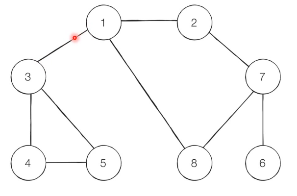
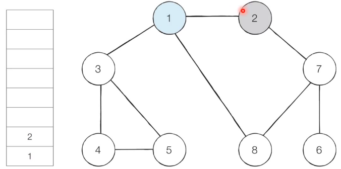
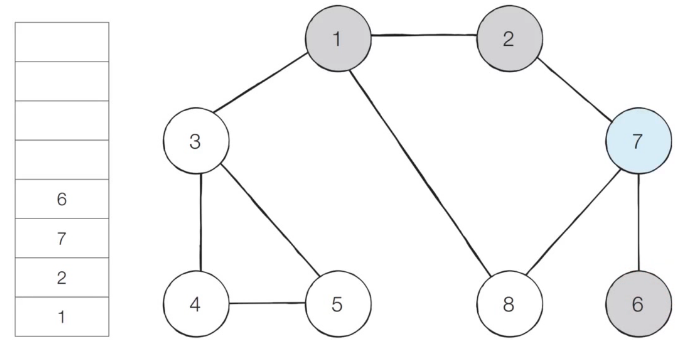
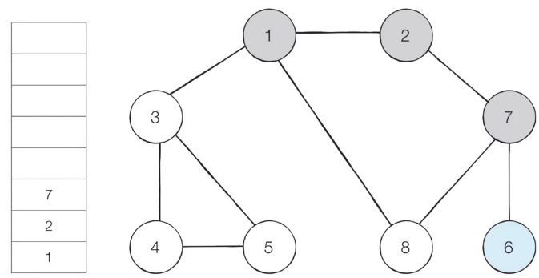
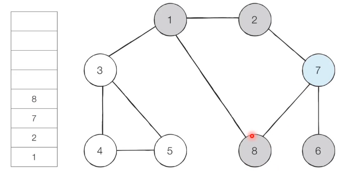
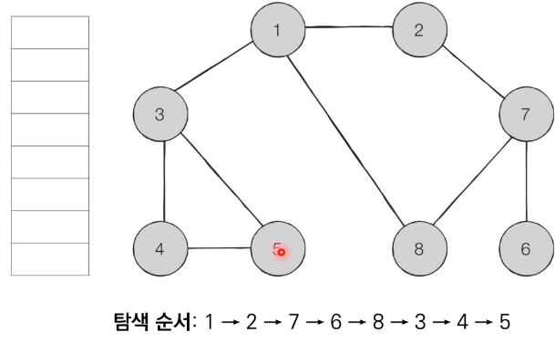

 ## 깊이 우선 탐색(Depth-First Search)

- 그래프에서 깊은 부분을 우선적으로 탐색하는 알고리즘,
- 스택 자료구조(혹은 재귀 함수)를 이용하며, 구체적인 동작 과정은 다음과 같다.
  1. 탐색 시작 노드를 스택에 삽입하고 방문 처리를 한다.
  2. 스택의 최상단 노드에 방문하지 않은 인접한 노드가 하나라도 있으면 그 노드를 스택에 넣고 방문 처리한다. 방문하지 않은 인접 노드가 없으면 스택에서 최상단 노드를 꺼낸다
  3. 더 이상 2번의 과정을 수행할 수 없을 때까지 반복한다.


### 동작 예시

---



**[step 1]**

- 시작 노드: 1
- 방문 기준: 번호가 낮은 인접 노드부터




**[step 2]**

- 스택의 최상단 노드인 '1'에 방문하지 않은 인접한 노드 '2','3','8'.
- 이 중에서 가장 작은 노드인 '2'를 스택에 넣고 방문 처리함.

...

...




**[step 4]**

- 같은 방식으로 '2'에 방문하지 않은 인접 노드 중 가장 작은 노드 '7'
- '7'에 인접한 가장 작은 노드 '6'을 방문 처리 함.




**[step 5]**

**그런데, 스택 최상단 노드인 '6'에 방문하지 않은 인접 노드가 없다. 따라서 스택에서 '6'번 노드를 꺼낸다.**




**[step 6]**

- 스택의 최상단 노드인 '7'에 방문하지 않은 인접 노드 '8'이 있다.
- 따라서 '8'번 노드를 스택에 넣고 방문 처리한다.


...

...

...




- 이러한 과정을 반복했을 때 **전체 노드의 탐색 순서**(스택에 들어간 순서)는 다음과 같다.


### 소스코드 예제

---

```python
# P
# DFS 메서드 정의
def dfs(graph, v, visited):
    # 현재 노드를 방문 처리
    visited[v] = True
    print(v,end=' ')
    # 현재 노드와 연결된 다른 노드를 재귀적으로 방문
    for i in graph[v]:
        if not visited[i]:
            dfs(graph,i,visited)

# 각 노드가 연결된 정보를 표현(2차원 리스트)
graph=[
    [],
    [2,3,8],
    [1,7],
    [1,4,5],
    [3,5],
    [3,4],
    [7],
    [2,6,8],
    [1,7]
]

# 각 노드가 방문된 정보를 표현(1차원 리스트)
visited = [False] * 9

# 정의된 DFS 함수 호출
dfs(graph,1,visited)
>>>
1 2 7 6 8 3 4 5 
```

