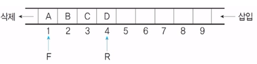

#### 큐

---

큐는 리스트의 한쪽에서는 삽입 작업이 이루어지고 다른 한쪽에서는 삭제 작업이 이루어지도록 구성한 자료 구조이다.

- 큐는 가장 먼저 삽입된 자료가 가장 먼저 삭제되는 **선입선출(FIFO; First In Last Out)** 방식으로 처리한다.
- 큐는 **시작과 끝을 표시하는 두 개의 포인터**가 있다.


#### 구조

---



- **프런트(F,Front) 포인터** : 가장 먼저 삽입된 자료의 기억 공간을 가리키는 포인터로, 삭제 작업을 할 때 사용한다.
- **리어(R,Rear) 포인터**: 가장 마지막에 삽입된 자료가 위치한 기억 공간을 가리키는 포인터로, 삽입 작업을 할 때 사용한다.
- **enQueue**: 큐에 데이터를 삽입하는 작동.
- **deQueue**: 데이터를 삭제(추출)하는 작동.
- **peek**: front에 있는 값을 꺼내지 않고 어떤 값인 지만 return 함.


#### 종류

---

- **선형큐**

- **[환형큐(원형큐;Circular Queue)](https://github.com/SeoulStrech/TIL/blob/master/Algorithm/Algorithm/queue_Cirqueue.md)** : 일반적인 선형 큐는 '큐에 데이터가 꽉 찼다면 더 이상 데이터를 추가할 수 없음. 단, 큐 사이즈를 늘리고 원소를 다시 복사하면 됨. 그러나 시간 속도 측면에서 비효율적임.', 'deQueue를 실행하게 되면 빈 공간이 생기면서 이를 활용할 수 없거나, 다음 원소들 모두를 앞으로 땡겨와야 하기 때문에 사이즈가 큰 데이터를 처리하기에 비효율적임.'이라는 치명적인 단점들이 있다. 이러한 단점들을 보완하는게 환형큐이다. 큐를 직선 형태로 놓는 것보다 원형으로 구현하는 것이다.

- **[우선순위큐(priority queue)](https://github.com/SeoulStrech/TIL/blob/master/Algorithm/Algorithm/queue_priority%20queue.md)**: 우선순위 큐는 <u>우선순위가 가장 높은 데이터를 가장 먼저 삭제하는 자료구조</u>이다. 데이터를 **우선순위에 따라** 처리하고 싶을 때 사용한다.

  


#### 응용

---

- 운영체제의 작업 스케줄링에 사용.

  

#### 구현

---

큐 구현 예제(python)

```python
from collections import deque
# 큐 구현을 위해 deque 라이브러리 사용, <시간 효율성 때문에>
queue = deque()

# 삽입/5 - 삽입/2 - 삽입/3 - 삽입/7 - 삭제() - 삽입/1 - 삽입/4 - 삭제()
queue.append(5)
queue.append(2)
queue.append(3)
queue.append(7)
queue.popleft()
queue.append(1)
queue.append(4)
queue.popleft()

print(queue)	# 먼저 들어온 순서대로 출력
queue.reverse() # 역순으로 바꾸기
print(queue)	# 나중에 들어온 원소부터 출력

>>>
deque([3,7,1,4])
deque([4,1,7,3])
```

내장함수 사용하지 않고 구현(python)

```python
Queue_list = list()
 
def enQueue(data):
    Queue_list.append(data)
 
 def deQueue():
     data = Queue_list
     del Queue_list[0]
     return data
```