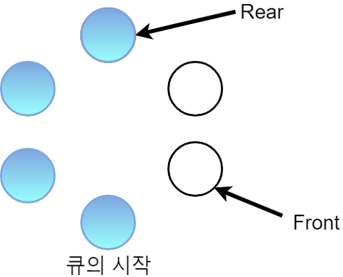

## 원형 큐(Circular Queue)

[참고](https://reakwon.tistory.com/30)

일반적인 선형 큐는 '큐에 데이터가 꽉 찼다면 더 이상 데이터를 추가할 수 없음. 단, 큐 사이즈를 늘리고 원소를 다시 복사하면 됨. 그러나 시간 속도 측면에서 비효율적임.', 'deQueue를 실행하게 되면 빈 공간이 생기면서 이를 활용할 수 없거나, 다음 원소들 모두를 앞으로 땡겨와야 하기 때문에 사이즈가 큰 데이터를 처리하기에 비효율적임.'이라는 치명적인 단점들이 있다. 이러한 단점들을 보완하는게 환형큐이다. 큐를 직선 형태로 놓는 것보다 원형으로 구현하는 것이다.



- 큐의 시작점은 어느 점이라도 된다.
- 아무 점이나 Front와 Rear로 정의하고, 색이 칠한 것은 노드가 삽입된 상태임을 뜻한다.


#### 원형 큐 구현

---

```c++
struct cirQueue{
    int arr[SIZE];      // 원형 큐의 사이즈
    int front, rear;      

    cirQueue(){
        front = SIZE -1;    // 인덱스 0을 지정
        rear = SIZE -1;
    }
}
```

- `cirQueue()`는 front와 rear의 초기값을 지정한다. 
- front와 rear를 배열의 마지막 원소로 지정한 것은 배열 인덱스 0부터 시작하려고 하기 때문이다. (선 증가 후 원소를 삽입). 0으로 해도 상관이 없긴 하다.


#### 원형 큐 연산

----

1. **isEmpty**

   큐가 비어있는지 확인하는 연산이다. 처음 큐의 front와 rear는 같은 자리에 위치하게 된다. 그리고 큐가 삽입되고 꺼내어지고 할 때는 역시 큐가 비어있게 된다면 front와 rear는 역시 같은 값이 된다. 

   ```c++
   bool isEmpty(){
       return rear == front;
   }
   ```

   

2. **isFUll**

   큐가 꽉 차있는 상태인지 확인하는 연산이다. rear +1 자리에 front가 있는 지 알아보면 된다.

   ```c++
   <p> isFull(){
       return ((rear+1)%SIZE)==front;  // 큐의 size로 나누는 이유는 계속 rear+1이 size보다 클 수 있기 때문에, SIZE-1의 원소(배열의 마지막 원소)를 가리키고 있고 다음 rear+1은 SIZE가 아니라 0이 되어야한다. 
   }
   </p>
   ```

   


3. **enQueue**

   큐에 원소를 삽입한다. 우선 큐가 FULL인지 아닌지 확인한다. 공간이 있다면 다음 원소를 추가시키기 위해 현재 rear 에서 1을 증가시킨다. 그 자리에 원소를 삽입하면 된다. 여기서도 역시 나머지 연산이 들어가는데, 원형큐이기 때문에 SIZE보다 크면 다시 처음부터 원소가 삽입되어야 하기 때문이다.

   ```c++
   void enQueue(int data){
       if (isFull()){
           cout << "Q is full" << endl;
           return;
       }
       rear = (rear+1) % SIZE;
       arr[rear] = data;
   }
   ```


4. **deQueue**

   큐에서 원소를 제거한다. 우선 큐가 EMPTY 인지 확인한다. 맨 처음 들어간 원소는 front+1이 된다. 이후 front를 한 칸 증가시켜 그 원소를 빼온다. 그러고 나면 front는 빈 원소를 가리키게 된다.

   ```c++
   int deQueue(){
       if(isEmpty){
           cout<< "Q is empty" << endl;
           return INF;
       }
       return arr[front = (front + 1) % SIZE];
   }
   ```

   