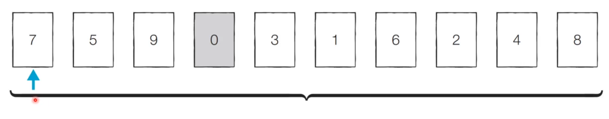
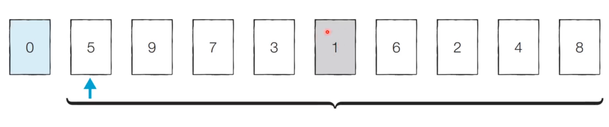
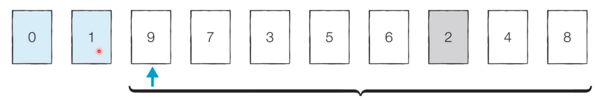
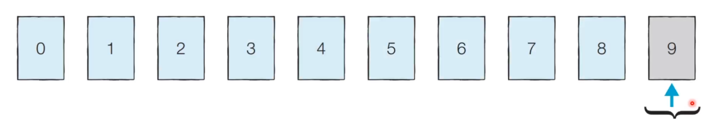

## 정렬

- 정렬이란 <u>데이터를 특정한 기준에 따라 순서대로 나열</u>하는 것.
- 일반적으로 문제 상황에 따라서 적절한 정렬 알고리즘이 공식처럼 사용됨.


## 선택 정렬

- 처리되지 않은 데이터 중에서 **가장 작은 데이터를 선택해 맨 앞에 있는 데이터와 바꾸는 것을 반복**하는 방법.

- 가장 원시적이고 기초적인 방법 중 하나.


---

### 선택 정렬 동작 예시



**[step 0]** 처리되지 않은 데이터 중 가장 작은 '0'을 선택해 가장 앞의 '7'과 바꿈.




**[step 1]** 처리되지 않은 데이터 중 가장 작은 '1'을 선택해 가장 앞의 '5'와 바꿈.




**[step 2]** 처리되지 않은 데이터 중 가장 작은 '2'를 선택해 가장 앞의 '9'와 바꿈

...

...

...



반복할 때마다 **탐색 범위는 줄어들게 되고**, 매번 제일 작은 데이터를 찾기 위해 탐색 범위에서 탐색을 하기 때문에, 매번 선형 탐색을 하는 것임. 이는 이중 반복문으로 구현할 수 있음.


### 선택 정렬 소스코드

---

```python
# P

array = [7,5,9,0,3,1,6,2,4,8]

for i in range(len(array)):
    min_index = i	#가장 작은 원소의 인덱스
    for j in range(i+1,len(array)):     # 현재 가장 작은 원소보다 더 작은 원소가 있다면, 그 위치 인덱스 값이 min_index로 담김.
        if array[min_index] > array[j]:	   
            min_index = j
    array[i], array[min_index] = array[min_index],array[i]

print(array)
>>>
[0, 1, 2, 3, 4, 5, 6, 7, 8, 9]
```


### 선택 정렬 시간복잡도

---

데이터의 개수가 N개일 때 총 몇 번의 비교 연산을 해야하는 지가 중요함. 선택 정렬은 대략 N * (N + 1)/2 번 가량의 연산을 수행해야 함. 이의 시간 복잡도는 **O(N^2)** 이다.
