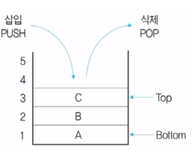

#### 스택

---

스택은 리스트의 한쪽 끝으로만 자료의 삽입, 삭제 작업이 이루어지는 자료 구조이다.

- 스택은 가장 나중에 삽입된 자료가 가장 먼저 삭제되는 후입선출(**LIFO**; Last In First Out) 방식으로 자료를 처리한다.
- 스택의 모든 기억 공간이 꽉 채워져 있는 상태에서 데이터가 삽입되면 Overflow가 발생하며, 더 이상 삭제할 데티어가 없는 상태에서 데이터를 삭제하면 Underflow가 발생한다.


#### 기본 구조

---



- 스택에 데이터를 삽입하는 작동 : **push**
- 스택에 데이터를 추출하는 작동 : **pop**
- 스택에 들어 있는 가장 위의 데이터(가장 마지막으로 삽입된 자료가 기억된 위치) : **top**
- 스택의 가장 밑바닥: **bottom**


#### 응용 분야

---

- 부 프로그램 호출 시 복귀주소를 저장할 때.
- 함수 호출의 순서 제어.
- 인터럽트가 발생하여 복귀주소를 저장할 때.
- Postfix Notation 으로 표현된 수식을 연산할 때.
- 0 주소 지정방식 명령어의 자료 저장소.
- 재귀(자기 자신, Recursive) 프로그램의 순서 제어.
- 컴파일러를 이용한 언어 번역 시.


#### 구현 예제

---

스택 구현 예제(C++)

```c++
# include <bits/stdc++.h>

using namespace std;

stack<int> s;

int main(void){
    s.push(5);
    s.push(2);
    s.push(3);
    s.push(7);
    s.pop();
    s.push(1);
    s.push(4);
    s.pop();
    // 스택의 최상단 원소부터 출력
    while (!s.empty()){
        cout << s.top() << ' ';
        s.pop();
    }
}

>>>	1 3 2 5
```

