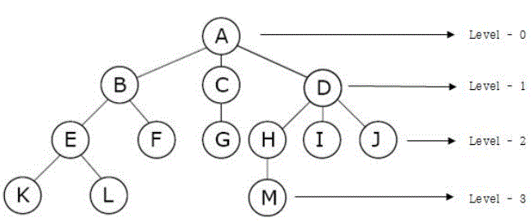

#### 트리

---

트리는 하나의 기억 공간을 의미하는 **정점(Node, 노드)**과 노드와 노드를 연결하는 **선(Link, 가지)**을 이용하여 사이클을 이루지 않도록 구성한 그래프의 특수한 형태이다. 가족의 계보(족보), 연산 수식, 회사 조직 구조도, 히프(Heap) 등을 표현하기에 적합하다.

#### 구조

---

- **노드(Node)** : 트리의 기본 요소로서 자료 항목과 다른 항목에 대한 가지(Branch)를 합친 것(A,B,C,D,...,K,L,M)
- **근 노드(Root Node)** : 트리의 맨 위에 있는 노드(A)
- **차수(Degree)** : 각 노드에서 아래로 뻗어나온 가지의 수(A=3, B=2,C=1,M=0)
- **크기(Size)** : 트리에 포함된 모든 노드의 개수
- **단말 노드(Terminal Node)** = 잎 노드(Leaf Node) : 자식이 하나도 없는 노드, Degree가 0인 노드(K,L,F,G,I,J,M)
- **비단말 노드(Non-Terminal Node)** : 자식이 하나라도 있는 노드, 즉 Degree가 0이 아닌 노드(A,B,C,D,E,H)
- **자식 노드(Son Node)** : 어떤 노드에 연결된 다음 레벨의 노드들(D의 자식 = H,I,J)
- **부모 노드(Parent Node)** : 어떤 노드에 연결된 이전 레벨의 노드들(E의 부모 = B)
- **형제 노드(Brother Node, Sibling)** : 동일한 부모를 갖는 노드들(형제 K,L / 형제 H,I,J)
- **Level** : 근 노드의 Level을 1로 가정한 후 어떤 Level이 L이면 자식 노드는 L+1
- **깊이(Depth, Height)** : 루트 노드로부터의 거리
- **높이(Height)** : 깊이 중 최댓값
- 기본적으로 트리의 크기가 N일 때, 전체 간선의 개수는 N-1 이다.