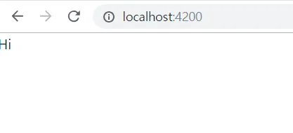

# ng-container

### ng-container는 Angular에서 사용하는 가상 요소(virtual element)로, 항상 view에 렌더링 된다.
`<ng-container> Hi </ng-container>`
- 
- ng-container는 부모 요소로부터 자식 요소를 분리하고, 조건부로 렌더링하거나 반복적으로 렌더링할 때 유용함.

무슨 말이냐?

ng-container를 사용하는 이유는 다음과 같음.

1. 조건부 렌더링
조건부 렌더링을 쉽게 구현할 수 있다. 예를 들어, ngIf 디렉티브를 사용하여 조건에 따라 렌더링할 요소를 ng-container 내부에 작성할 수 있다.
```html
<ng-container *ngIf="condition">
  …
</ng-container>
```

2. 반복 렌더링
ng-container를 사용하면 반복적으로 렌더링할 때 유용하다.

- Angular에서는 하나의 요소에 대해 여러 구조 디렉티브를 동시에 사용할 수 없다. (ngIf, ngFor 동시 사용 안됨. 에러남.)
- 따라서, 여러 구조 디렉티브를 동시에 사용해야 하는 경우, <ng-container> 요소를 사용하여 각 디렉티브를 감싸주는 방식으로 처리해야한다.
- <ng-container> 요소는 가상 요소이기 때문에 DOM 에서 실제로 생성되지 않음.

예를 들어, ngFor 디렉티브를 사용하여 배열의 요소를 반복하면서 ng-container 내부에 작성한 요소를 반복적으로 렌더링할 수 있다.
```html
<ul>
  <li *ngFor="let item of items" *ngIf="item.isValid">
    {{ item.name }}
  </li>
</ul>
```
를
```html
<ul>
  <ng-container *ngFor="let item of items">
    <li *ngIf="item.isValid">
      {{ item.name }}
    </li>
  </ng-container>
</ul>
```

3. 불필요한 요소 생성 방지
- ng-container는 부모 요소로부터 자식 요소를 분리할 수 있기 때문에, 불필요한 요소 생성을 방지할 수 있다.
- 예를 들어, ngIf 디렉티브를 사용하여 조건에 따라 렌더링할 요소를 ng-container 내부에 작성하면, 조건이 false인 경우 해당 요소가 생성되지 않는다.

4. HTML 유효성 검사
- ng-container는 HTML 유효성 검사를 통과할 수 있다.
- 예를 들어, ngIf 디렉티브를 사용하여 조건에 따라 렌더링할 요소를 ng-container 내부에 작성하면, 유효한 HTML 구조를 유지할 수 있다.