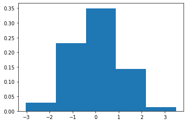
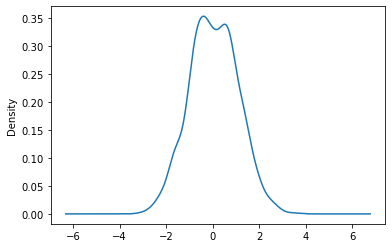

## 히스토그램

**`hist()`함수**

- 자료의 분포 상태를 직사각형 모양의 막대 그래프로 나타낸 것.

- **데이터의 빈도**에 따라 높이가 결정된다.

- ```
  plt.hist(['data set'])
  ```

  ---
  
  
  
- bins 옵션은 <u>가로축의 구간 개수</u>를 설정하는 속성

  > `plt.hist(jan,bins=10)`
  >
  > .png)

  > `plt.hist(jan,bins=100)`
  >
  > .png)

---

- **cumulative** 파라미터를 **True**로 지정하면 누적 히스토그램을 출력한다. 디폴트는 **False**로 지정.

  `plt.hist(jan,bins=10,cumulative=True,color='pink',label='Aug')`

  > .png)

---

- 히스토그램의 종류를 지정

  `histtype='bar'`,`histtype='barstacked'`,`histtype='step'`,`histtype='stepfilled'`

---

- 밀도함수 출력

  `hist()` 함수 내에 **`density=boolean`** 값을 추가할 수 있다. True로 설정 시 막대 아래 총 면적이 1이 되는 밀도함수 출력, 즉, y 축 값이 확률로 변경되어 출력된다.

  > 


---

- 커널 밀도 함수(kernel density estimation) 출력

  **kind='kde'**로 그래프 종류를 설정하면 연속형 히스토그램인 커널 밀도 함수가 출력된다.

  > 
