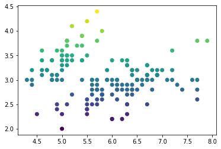
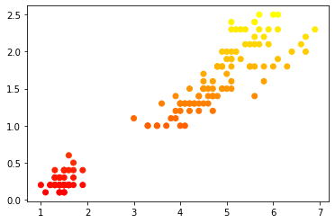
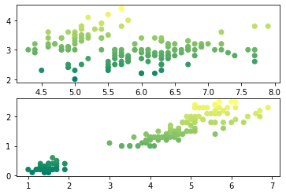

## 그래프 여러개 그리기


**`subplot()`** 함수

- 여러 개의 그래프를 하나의 그림에 나타내도록 해준다.

- `plt.subplot(row,column,index)`

  > 
  
- 예시로 정리를 하기 위해 다음과 같은 데이터 셋을 받아 그래프를 작성했다.

  ```lisp
  ## iris data 사용
  
  from sklearn.datasets import load_iris
  
  iris=load_iris()
  iris_x=iris['data']
  x_names = iris['feature_names']
  ```
  
  **iris**데이터를 불러오고 `iris_x`에 저장했다.
  
  
  
  ```
  plt.scatter(iris_x[:,0], #x축 좌표 (첫번째 설명변수)
  			iris_x[:,1], #y축 좌표 (두번째 설명변수)
  			c = iris_x[:,1]) # 서로 다른 숫자 전달 시, 서로 다른 색으로 표현이 됨(채도)
  ```
  
  > 
  
  위 그래프를 **1번 그래프**라고 명명한다.
  
  
  ```
  plt.scatter(iris_x[:,2], iris_x[:,3], c=iris_x[:,3])
  ```
  
  > 
  
  위 그래프를 **2번 그래프**라고 명명한다.
  
  
  
  **1번,2번 그래프**를 합쳐서 표현하려면 **`subplot()`**을 함수를 쓰면 되는데, 함수안에 (행,열,순서) 위치를 적어주면 된다.
  
  ```
  plt.subplot(2,1,1)  # 2*1 그래프 중 1번째 
  plt.scatter(iris_x[:,0], iris_x[:,1], c=iris_x[:,1])
  
  plt.subplot(2,1,2)  # 2*1 그래프 중 2번째
  plt.scatter(iris_x[:,2], iris_x[:,3], c=iris_x[:,3])
  ```
  
  >
  
  이와 같은 방식으로 크기와 위치에 맞게 `subplot`을 이용하여 그래프 출력 개수를 늘릴수 있다.