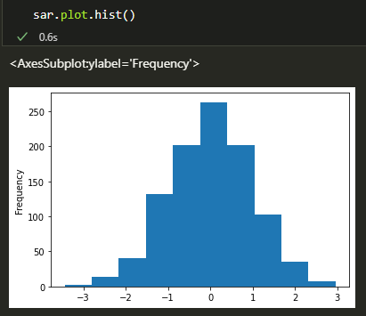
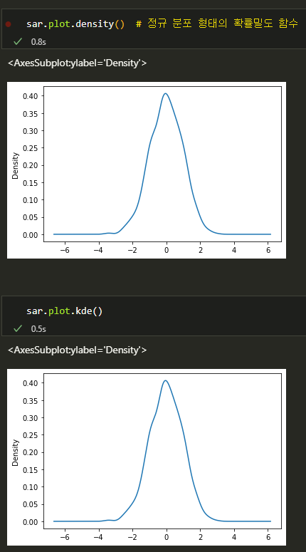
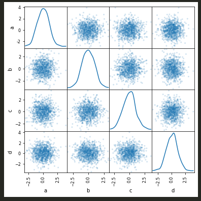

# KDE

## 커널 밀도 함수

통계에서 임의 변수의 확률밀도함수(PDF)를 추정하는 비모수적 방법.

이 함수는 가우스 커널을 사용하며 자동 대역폭 결정을 포함함.

```python
sar = pd.Series(np.random.randn(1000))
```







### Scatter matrix plot 산점도 행렬


```python
from pandas.plotting import scatter_matrix
df = pd.DataFrame(np.random.randn(1000,4),columns=['a','b','c','d'])

scatter_matrix(df,alpha=0.2,figsize=(6,6),diagonal='kde')
# diagonal: {'hist,'kde'} 대각선에 히스토그램 또는 커널밀도 함수 그리기
```

