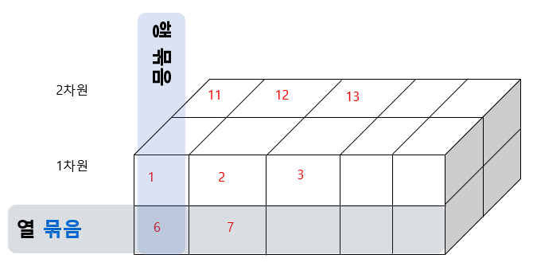

간단한 예로 이해하기.

### **[1] 2차원 배열**

**axis=0 : 열 방향/ 수직 방향**

*axis=1 : 행 방향/ 수평 방향**

```python
import numpy as np
a = np.arange(1,21).reshape(4,5)
a
>>>
array([[ 1,  2,  3,  4,  5],
       [ 6,  7,  8,  9, 10],
       [11, 12, 13, 14, 15],
       [16, 17, 18, 19, 20]])
```

`numpy`를 사용하여 1~20까지의 정수를 가진 배열을 생성하고 4x5행으로 리쉐잎 해주었다.

`axis=0` 열방향으로 `sum`을 해보자.

```python
a.sum(axis=0)
>>> array([34, 38, 42, 46, 50])

print(a[:,0].sum(),a[:,1].sum(),a[:,2].sum(),a[:,3].sum(),a[:,4].sum())
>>> 34 38 42 46 50

a.sum(axis=1)
array([15, 40, 65, 90]
```

원소가 열 방향으로 더해져 출력된 것을 볼 수 있다. 행 방향도 맞게 출력된다. 

```python
import pandas as pd
from pandas import DataFrame,Series
DataFrame(a)
>>>

	0	1	2	3	4
0	1	2	3	4	5
1	6	7	8	9	10
2	11	12	13	14	15
3	16	17	18	19	20

a.sum(axis=0)
>>> array([34, 38, 42, 46, 50])
```

DataFrame에서도 마찬가지다. 즉, 2차원의 배열에서는 함수가 설정해준 열,행 방향 그대로 적용된다고 생각하면 된다. 

---


### [2] 3차원 배열

```python
b = np.arange(1,21).reshape(2,2,5) # 차원, 행, 열
print('몇 차원? : %d 차원' % b.ndim)
print(b)

>>>
몇 차원 ? : 3 차원
[[[ 1  2  3  4  5]
  [ 6  7  8  9 10]]

 [[11 12 13 14 15]
  [16 17 18 19 20]]]
```

먼저 3차원 배열 `b`를 생성했다. 2x5 형태의 배열이 2개가 있다는 뜻이다. `shape`의 (2,2,5) 는 (차원, 행, 열) 을 의미한다. 이를 그림으로 그려보면, 

이와 같은 배열이 생성됐다고 생각할 수 있다.

**그리고 3차원 배열에서는 `axis` 축이 가르키는 값이 바뀐다.**

| **axis=0** | 차원을 묶는다 |
| ---------- | ------------------ |
| **axis=1**     | 행을 묶는다 |
| **axis=2**     | 열을 묶는다 |

3차원에서는 단순히 방향이 아니라 각각의 차원,행,열끼리 묶는다고 생각해야 한다.

```python
## 차원끼리 묶는다 
b.sum(axis=0)
>>>
array([[12, 14, 16, 18, 20],
       [22, 24, 26, 28, 30]])


## 각각의 행을 묶는다
b.sum(axis=1)
>>>
array([[ 7,  9, 11, 13, 15],
       [27, 29, 31, 33, 35]])


## 각각의 열을 묶는다
b.sum(axis=2)
>>>
array([[15, 40],
       [65, 90]])
```

