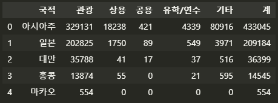
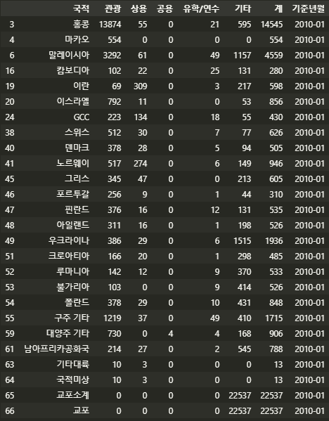
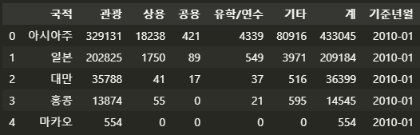
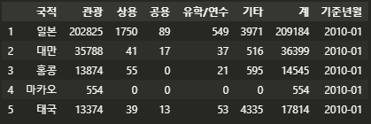
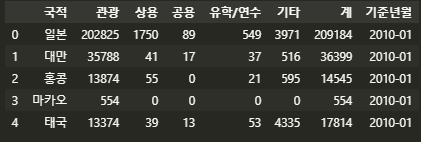
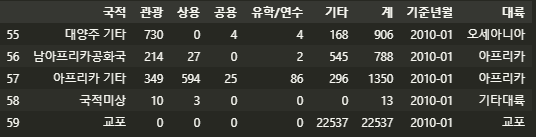
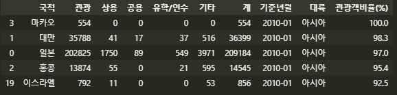
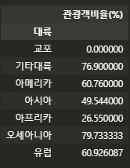
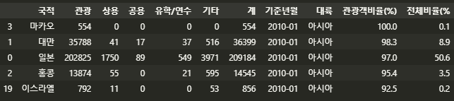

## COVID 19 의 영향으로 중국인 관광객이 얼마나 줄었을까?

월별 외국인 관광객 통계에 대한 데이터를 수집하고, 이를 전처리해보자. 이 결과를 시각화해서 국적별로 외국인 관광객 수에 어떤 계절적인 패턴이 있는지, 외국인 관광객의 방문이 증가한(혹은 감소한) 원인이 되는 이벤트들이 무엇인지 생각해 보는 것이 이번 주제의 목표이다.


#### 4.1 외국인 출입국 통계 데이터 구하기

한국관광공사의 공공빅데이터 플랫폼; **한국관광 데이터랩**에서 데이터를 구했다.


#### 4.2 데이터 불러오기 및 전처리

구한 데이터는 형태가 동일한 총 125개의 엑셀 파일이다. 아무 엑셀 파일이나 확인해서 특징을 파악했다.

1. 첫 번째 로우에는 해당 파일 데이터의 시점/종류가 서술돼 있다. 이번 데이터 분석에는 활용하지 않음으로 제외해야 한다.
2. 총 10개의 칼럼이 있다. 이 중 A~G(국적,관광,상용,공용,유학/연수,기타, 계) 를 활용한다.
3. 3번째~69번째 로우에는 대륙, 국가 별 관광객 수 데이터가 구성돼 있다.
4. 70번째~73번째 로우에는 데이터의 요약 정보가 구성돼 있다. 사용하지 않음으로 제외해야 한다.

정리해보자면 2번째 로우에 칼럼명이 있고, A~G 칼럼을 불러와야 하고, 1번째와 마지막 4개 로우는 제거해야한다.


#### 4.2.3 파이썬에서 엑셀 데이터 불러오기

```python
import pandas as pd
kto_201001 = pd.read_excel('./files/kto_201001.xlsx',
                           header=1,		## 두 번째 줄을 변수명으로 저장
                           usecols='A:G',	## A~G 열 사용
                           skipfooter=4)	## 마지막 4줄 생략
kto_201001.head()
```

> 


#### 4.2.3 데이터 전처리

 **`info()`,`describe()`** 를 사용하여 데이터의 정보를 먼저 탐색했다.

최솟값이 0인 것들이 있다. 각 컬럼에서 0인 부분을 필터링한다. **|(or) 조건**을 이용해 4가지 목적 중 한 가지라도 입국개구가 0인 국적으로 필터링한다.

```python
condition = (kto_201901['관광'] == 0) | (kto_201901['상용'] == 0) | (kto_201901['공용'] == 0) | (kto_201901['유학/연수'] == 0)
kto_201901[condition]
```

> 


##### 데이터 프레임에 기준년월 추가

각 데이터마다 기준년월 정보가 필요하다. '기준년월' 칼럼을 생성하고 데이터를 할당한다.

```python
kto_201001['기준년월'] = '2010-01'
kto_201001.head()
```

> 


##### 국적 데이터만 남기기

국적 칼럼에 어떤 항목들이 있는지 살펴본다. **`unique`**함수를 사용하여 중복값이 없는, 즉 원소를 출력한다.

```python
kto_201001['국적'].unique()
```

>

'아시아주', '대양주' 등 **총 7개의 국적이 아닌 값**들이 포함되어 있다. 이 7개의 값을 대륙 목록으로 만들고, 이에 해당하는 값을 제외하도록 한다.

```python
continents_list = ['아시아주','미주','구주','대양주','아프리카주','기타대륙','교포소계']

condition = (kto_201001.국적.isin(continents_list) == False) 
kto_201001_country = kto_201001[condition]
kto_201001_country['국적'].unique()
```

> 

출력 결과, 국적 칼럼에 국가명만 남은 것을 확인할 수 있다. 만들어진 kto_201001_country 데이터를 확인한다.

> 

인덱스가 1 부터 시작하므로 인덱스 값을 초기화 한다.

```python
kto_201001_country = kto_201001_country.reset_index(drop=True)
kto_201001_country.head()
```

>

> `reset_index()` 함수를 사용하여 인덱스 값을 0부터 시작하도록 초기화했고, drop=True 라는 인자를 써서 인덱스 값이 새로운 칼럼으로 생성되지 않도록 했다.


##### 대륙 칼럼 만들기

각각의 국적이 어느 대륙에 속하는지 대륙 칼럼을 생성한다. 원본 데이터의 국적은 대륙 별로, 순서대로 정렬되어 있다. 때문에 새로 만들 대륙 칼럼의 내용은 순서대로 '아시아' 값이 25개, '미주' 5개 .... 로 구성돼야 한다. 대륙 칼럼에 넣을 continents 리스트를 만든다.

```python
continents = ['아시아']*25 + ['아메리카']*5 + ['유럽']*23 + ['오세아니아']*3 \
+ ['아프리카']*2 + ['기타대륙'] + ['교포']
```

이를 데이터의 대륙 칼럼으로 추가한다.

```python
kto_201001_country['대륙'] = continents
kto_201001_country.tail()
```

> 

대륙 칼럼이 정상적으로 추가됐다.


##### 국적별 관광객 비율 살펴보기

한국을 방문하는 외국인 중에서 관광목적으로 입국하는 비율을 국가별로 비교한다. 이를 위해 국적별로 관광객 수를 전체 입국객 수로 나눈 관광객비율(%) 칼럼을 만든다. 그리고 이를 내림차순 한다.

```python
kto_201001_country['관광객비율(%)'] = round(kto_201001_country['관광']/kto_201001_country['계']*100,1)

kto_201001_country = kto_201001_country.sort_values(by='관광객비율(%)',ascending=False)
kto_201001_country.head()
```

> 

'관광객비율(%)' 칼럼을 추가하여 값을 넣고, 이를 기준으로 내림차순 정렬했다.


 **대륙별 관광객 비율의 평균**

```python
kto_201001_country.pivot_table(values='관광객비율(%)',index='대륙',aggfunc='mean')
```

> 

`pivot_table`을 이용해 **대륙별로 관광객 비율의 평균**이 어떻게 되는지 확인했다.


##### 기준년월별로 전체 외국인 관광객 대비 국적별 관광객 비율 살펴보기

이를 위해 우리나라에 관광 목적으로 방문하는 전체 외국인들 대비 국적별 관광객의 비율을 구해야 한다.

```python
tourist_sum=sum(kto_201001_country['관광'])
tourist_sum
>>>
400818
```

2010년 1월에 한국을 방문한 전체 외국인의 수는 400,818명이다. 국적별 외국인 관광객 수를 이 합계로 나누면 국가별로 전체 외국인 관광객 대비 차지하는 비율을 구할 수 있다.

```python
kto_201001_country['전체비율(%)'] = round(kto_201001_country['관광']/tourist_sum * 100,1)
kto_201001_country.head()
```

> 

'전체비율(%)' 칼럼을 생성하고 값을 넣었다.

<u>전체비율을 통해 우리나라를 방문하는 외국인 관광객 중 비율이 높은 상위 5개국은 '마카오,대만,일본,홍콩,이스라엘' 이고 그 전체 비율은 63.3 % 를 차지한다는 것을 알 수 있다.</u>
