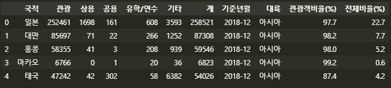
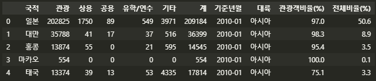
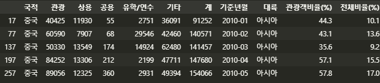

#### 4.2.4 데이터 전처리 과정을 함수로 만들기

subject04_1 에서 진행한 전처리에 대한 함수를 만든다. 앞서 진행한 내용은 1 개의 파일에 대한 데이터 전처리임으로 총 125개의 데이터 전처리를 반복하기 위해 함수를 생성하는 것이다.


```python
def create_kto_data(yy, mm):  
    #1. 불러올 Excel 파일 경로를 지정
    file_path = 'C:/Users/yj/datasalon/4_Tourists_Event/files/kto_{}{}.xlsx'.format(yy, mm)  
    
    # 2. Excel 파일 불러오기 
    df = pd.read_excel(file_path, header=1, skipfooter=4, usecols='A:G')
    
    # 3. "기준년월" 컬럼 추가 
    df['기준년월'] = '{}-{}'.format(yy, mm) 
    
    # 4. "국적" 컬럼에서 대륙 제거하고 국가만 남기기 
    ignore_list = ['아시아주', '미주', '구주', '대양주', '아프리카주', '기타대륙', '교포소계']   	 # 제거할 대륙명 선정하기 
    
    condition = (df['국적'].isin(ignore_list) == False)    # 대륙 미포함 조건 
    df_country = df[condition].reset_index(drop=True) 
    
    # 5. "대륙" 컬럼 추가 
    continents = ['아시아']*25 + ['아메리카']*5 + ['유럽']*23 + ['대양주']*3 + ['아프리카']*2 + ['기타대륙'] + ['교포']    # 대륙 컬럼 생성을 위한 목록 만들어 놓기 
    df_country['대륙'] = continents   
                       
    # 6. 국가별 "관광객비율(%)" 컬럼 추가
    df_country['관광객비율(%)'] = round(df_country.관광 / df_country.계 * 100, 1) 
                       
    # 7. "전체비율(%)" 컬럼 추가
    tourist_sum = sum(df_country['관광'])
    df_country['전체비율(%)'] = round(df_country['관광'] / tourist_sum * 100, 1)
    
    # 8. 결과 출력
    return(df_country)
```

```python
kto_test = create_kto_data(2018, '12')
kto_test.head()
```

> 


##### 반복문을 통해 다수의 엑셀 데이터를 불러와서 합치기

위에서 원하는 년,월의 엑셀 파일을 불러와 전처리하는 함수를 생성했다. 이제 반복문을 통해 125개의 엑셀 파일을 전처리하고 하나의 파일로 통합한다. 불러올 파일명은 kto_201001.xlsx 와 같은 형태로 `kto_yyyymm.xlsx`의 형태를 가진다. 이중 반복문으로 기준년월을 출력하는 코드를 구현해 보자.

```python
for yy in range(2010,2021):
    for mm in range(1,13):
        mm_str = str(mm).zfill(2)
        yymm = '{}{}'.format(yy,mm_str)
        print(yymm)
```

```tex
>>>
201001
201002
201003
201004
201005
201006
201007
201008
201009
201010
201011
201012
201101
201102
...
```

**`zfill()`** 함수를 사용해서 날짜 부분을 2자리 형태를 맞추었다.


이제 125개 파일을 통합하려면 각 파일을 불러와서 모을 공간이 필요하다. 데이터를 담을 빈 데이터프레임을 만들고 엑셀 파일을 하나씩 불러와서 붙이는 작업을 진행한다.

```python
df = pd.DataFrame()

for yy in range(2010, 2021):
    for mm in range(1, 13):
        temp = create_kto_data(str(yy), str(mm).zfill(2))
        df = df.append(temp, ignore_index=True)
        
df.head()
df.info()
```

> 
>
> 

총 7500개(125 개월 * 60개의 국적)의 로우가 관측되는 것을 확인할 수 있다.


##### 통합 데이터를 엑셀 파일로 저장하기

```python
df.to_excel('./files/kto_total.xlsx', index = False)
```


##### 국적별 필터링된 데이터를 엑셀 파일로 저장하기

경우에 따라서 특성에 맞는 개별 데이터로 저장해야 하는 상황이 있다. 이번에는 반복문을 통해 통합된 외국인 관광객 데이터를 국적별로 필터링해서 총 60개의 국적별 엑셀 파일로 저장한다. 먼저 통합된 전체 외국인 관광객 데이터에서 중국인 관광객 데이터만 필터링한다.

```python
condition = (df['국적'] == '중국')
df_filter = df[condition]
df_filter.head()
```

> 

df 데이터의 국적 칼럼이 중국인 경우를 condition에 저장 후 이를 df_filter에 저장했다. 이제 이 df_filter 데이터를 파일로 저장한다.

```python
file_path = './files/[국적별 관광객 데이터] 중국.xlsx'
df_filter.to_excel(file_path, index = False)
```


이제 모든 국적별 데이터로 필터링해서 각각 저장한다. 먼저 전체 데이터에서 어떤 나라들이 있는지 확인해 보고, 반복문에 사용할 수 있도록 국적 리스트를 만든다.

```python
cntry_list = df['국적'].unique()
len(cntry_list) 
>>> 60
```

df 데이터의 국적 칼럼에 `unique()` 함수를 적용해 고유한 값들을 할당하고 그 개수를 알아봤다. 이제 cntry_list를 반복문에서 활용해 개별 국적별 관광객 데이터를 저장한다.

```python
for cntry in cntry_list: 
    # 국적으로 필터링 
    condition = (df['국적'] == cntry)
    df_filter = df[condition]
    
    # 국적이름을 반영한 파일명 만들기 
    file_path = './files/[국적별 관광객 데이터] {}.xlsx'.format(cntry)
    
    # 정해 놓은 파일명으로 저장하기 
    df_filter.to_excel(file_path, index = False)
```

cntry_list 의 원소들을 순서대로 cntry에 입력시키는 반복문을 사용하였고, 반복문 내부에서는 먼저 df 데이터의 국적 칼럼이 cntry 인 경우를 df_filter 변수에 저장했다. 다음으로 `format()` 함수를 사용하여 국적명이 반영되는 파일 경로와 파일명을 file_path 변수에 입력했다.