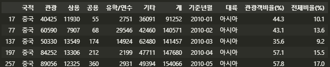
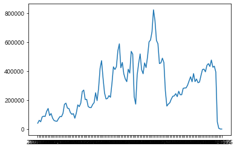
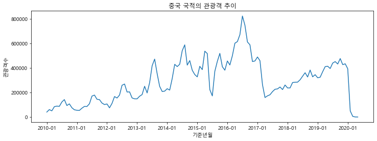
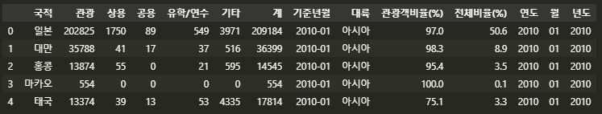
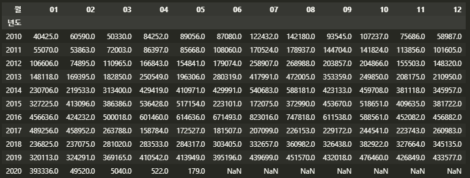
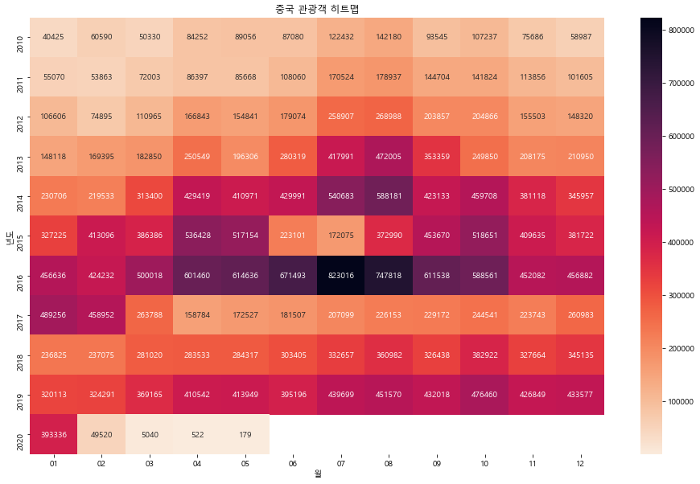

### 4.3 데이터 시각화

#### 4.3.2 시계열 그래프 그리기

```python
import pandas as pd
import matplotlib.pyplot as plt
df = pd.read_csv('./files/kto_total.xlsx')

## 그래프에서 한글 표기를 위한 글자체 변경(윈도우, 맥os 각각의 경우에 대해서 처리)
from matplotlib import font_manager, rc
import platform 

if platform.system() == 'Windows': 
    path = 'c:/Windows/Fonts/malgun.ttf'
    font_name = font_manager.FontProperties(fname=path).get_name()
    rc('font', family=font_name)
elif platform.system() == 'Darwin':
    rc('font', family='AppleGothic')
else: 
    print('Check your OS system')
```

그래프를 그리기 위한 사전 작업을 해준다. 그럼 이제 월별 중국인 관광객 그래프를 그려본다. 이를 위해 전체 관광객 데이터 중에서 중국 국적의 관광객 수를 추출한다.

```python
condition = (df['국적']=='중국')
df_filter = df[condition]
df_filter.head()
```

> 

이 데이터를 가지고 그래프를 그려본다.

```python
plt.plot(df_filter['기준년월'], df_filter['관광'])	## x축, y축
plt.show()
```



값이 너무 많아 이를 좀 수정한다.

```python
## 그래프 크기 조절 
plt.figure(figsize = (12, 4))

plt.plot(df_filter['기준년월'], df_filter['관광'])

## 그래프 타이틀, X축, Y축 라벨 설정 
plt.title('중국 국적의 관광객 추이')
plt.xlabel('기준년월')
plt.ylabel('관광객수')

## x 축 눈금 값 설정 
plt.xticks(['2010-01', '2011-01', '2012-01', '2013-01', '2014-01', '2015-01', '2016-01', '2017-01', '2018-01', '2019-01', '2020-01'])

plt.show()
```




다음은 상위 5개 국가의 리스트를 만들어 여러 그래프를 출력하는 코드이다.

```python
cntry_list = ['중국', '일본', '대만', '미국', '홍콩']

for cntry in cntry_list: 
    # 국적 관광객만 추출 
    condition = (df['국적'] == cntry)
    df_filter = df[condition]

    plt.figure(figsize = (12, 4))
    plt.plot(df_filter['기준년월'], df_filter['관광'])
    plt.title('{} 국적의 관광객 추이'.format(cntry))
    plt.xlabel('기준년월')
    plt.ylabel('관광객수')
    plt.xticks(['2010-01', '2011-01', '2012-01', '2013-01', '2014-01', '2015-01', '2016-01', '2017-01', '2018-01', '2019-01', '2020-01'])
    plt.show()
```


#### 4.3.3 히트맵 그래프 그리기

##### 데이터 처리하기

`str.slice()` 함수를 이용해 연도, 월 칼럼을 만든다.

```python
df['년도'] = df['기준년월'].str.slice(0,4)
df['월'] = df['기준년월'].str.slice(5, 7)
df.head()
```

> 


중국인 관광객만 뽑아 필터링하고 년도, 월을 기준으로 pivot_table 을 생성한다.

```python
df_filter = df[df['국적']=='중국']

df_pivot = df_filter.pivot_table(values = '관광'
                         , index = '년도'
                         , columns = '월')
```

> 


##### 히트맵 그리기

seaborn 라이브러리를 사용한다.

```python
import matplotlib.pyplot as plt 
import seaborn as sns

plt.figure(figsize = (16, 10))

## 히트맵 그래프 그리기
## annot = True : 히트맵 그래프의 각 칸에 실제 값을 표시한다.
## cmap = 'rocket_r' : 그래프의 색깔 조합을 지정
sns.heatmap(df_pivot, annot = True, fmt = '.0f', cmap = 'rocket_r')

plt.title('중국 관광객 히트맵')
plt.show()
```




### 시각화 해석하기

---


**먼저 시계열 그래프를 통해 어떤 특징이 있는지 살펴봤다.** **크게 보이는 계절적인 패턴이 존재하는지(Seasonality), 추세가 어떤지(Trend), 큰 변화가 있었는지(Event)를 정리했다.**


1. 2010년 부터 2016년까지 관광객 수가 꾸준히 증가(Trend)
2. 2017년 초에 관광객 수가 큰 폭으로 감소(Event)
3. 2017년 중순부터 다시 완만하게 증가(Trend)
4. 매년 여름에 관광객 수가 최댓값을 가짐(Seasonality)
5. 단, 2015년 여름에는 큰 폭으로 감소(Event)
6. 2020년 초에 급격한 감소(Event)


**두 번째로 히트맵 그래프를 통해 어떤 특징이 있는지 살펴봤다.**


1. 위에서 아래로 오면서 색깔이 진해지는 것으로 보아 2010년 1월부터 17년 3월까지 관광객 수가 꾸준히 증가(T)

2. 각 연도를 기준으로 봤을 때 7~8월이 대체로 진한 색임. 그 다음으로 4월, 10월. (S)

3. 2015년 6~8월엔 관광객 수가 적음(E)

4. 2017년 3~6월은 관광객 수가 매우 적음(E)

5. 17년 7월부터 19년 4월까지 점차 많아짐(T)

6. 20년 2월부터 관광객 수 급감(E)

   

- 계절적 특징으로 중국인 관광객은 '여름>봄,가을>겨울' 순으로 많이 방문한다는 사실을 알 수 있다.

- 구글링해보면 15년 6~8월에는 '메르스', 17년 3월엔 '사드', 20년 2월엔  '코로나' 때문에 관광객 수가 감소했다는 것을 알 수 있다.


### 결론

---

시계열 그래프는 시간의 흐름에 따른 추세를 파악하기 쉽고, 히트맵 그래프에서는 정확한 시점 파익 및 월별 비교가 용이하다는 특징이 있었다.