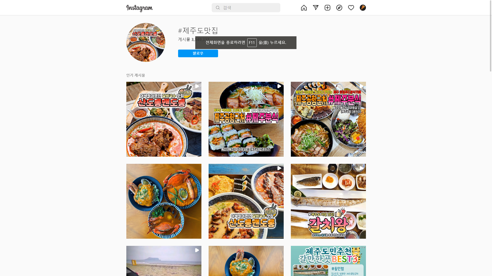
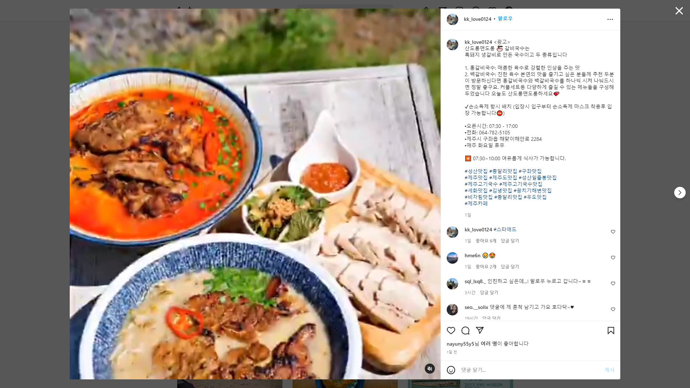
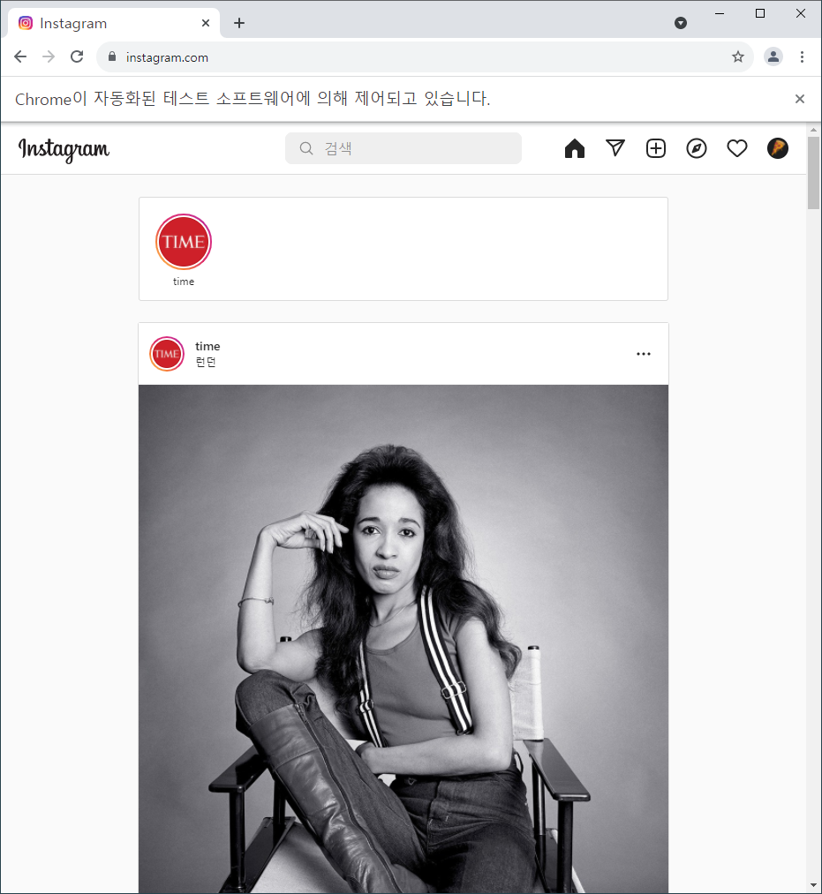
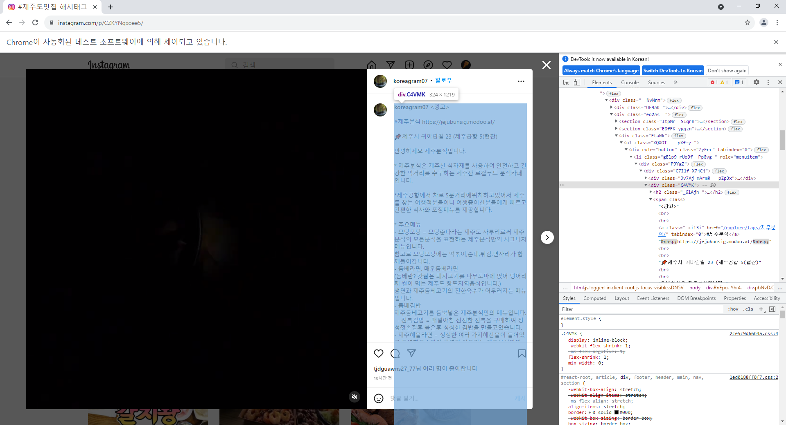
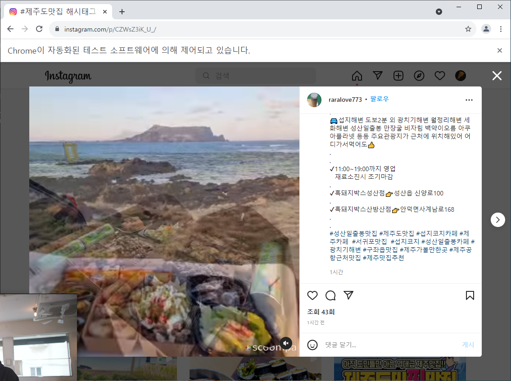
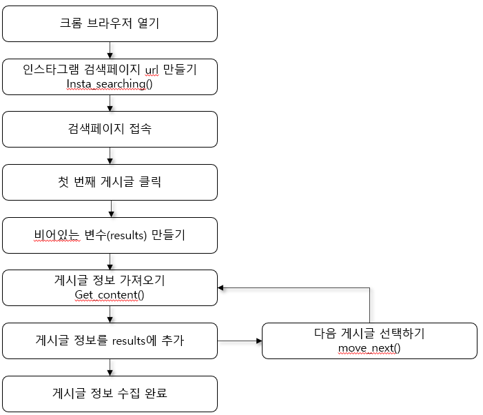
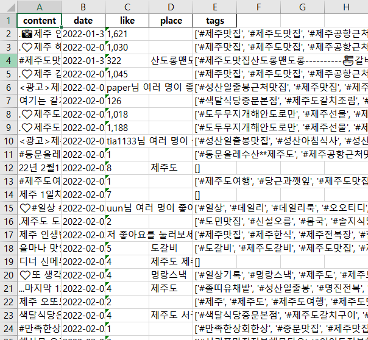
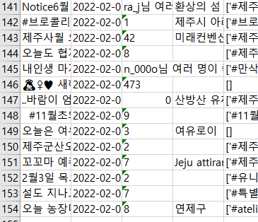

## 인스타그램 크롤링

#### 이번 주제의 목표

1. 인스타그램에서 키워드를 검색하고 그 결과를 저장
2. 저장된 데이터를 활용해 태그의 빈도수를 집계하여 워드 클라우드를 만듬
3. 위치 정보를 지도에 시각화

---

##### 5.1 인스타그램 크롤링

먼저 [인스타그램](https://www.instagram.com)에 접속해서 로그인한 뒤, 키워드를 검색함. "제주도 맛집"으로 검색.



주소 표시줄을 보면 `https://www.instagram.com/explore/tags/제주도맛집/` 으로 나온다. 마찬가지로 다른 키워드를 입력했을 때, `tags/{}/` 부분이 바뀌는 것을 알 수 있다. 이를 이용하여 일련의 과정을 거치지 않고 검색 결과를 확인할 수 있다.

검색 결과에서 첫 번째 게시글을 클릭해보자. 여기서 화면에 표시되는 내용을 가져온다. 즉, 사진 우측에 표시되는 본문 내용, 작성 일시 등을 확인할 수 있다.



---


##### 5.2 인스타그램 접속 후 로그인

```python
# selenium으로 특정 url 접속
from selenium import webdriver
driver = webdriver.Chrome('C:/Users/yj/Desktop/datasalon/chromedriver.exe')

# 인스타그램 접속
import time
driver.get('https://www.instagram.com')
time.sleep(2)   # 2초간 대기

# 인스타그램 로그인
email = 'E'
input_id = driver.find_elements_by_css_selector('input._2hvTZ.pexuQ.zyHYP')[0]
input_id.clear()
input_id.send_keys(email)

password = 'P'
input_pw = driver.find_elements_by_css_selector('input._2hvTZ.pexuQ.zyHYP')[1]
input_pw.clear()
input_pw.send_keys(password)
input_pw.submit()
time.sleep(3)
```



---


##### 5.3 인스타그램 검색 결과 URL을 만들어 접속

키워드 검색 겨로가를 나타내는 URL을 만들어 게시글에 접근해본다.

```python
# word 매게 변수를 입력받아 해당 url을 반환하는 함수 생성
def insta_searching(word):
    url = 'https://www.instagram.com/explore/tags/'+word
    return url

# 검색 결과 페이지 접속
word = '제주도맛집'
url = insta_searching(word)
driver.get(url)
```

---


##### 5.4 첫 번째 게시글 정보 열고 가져오기



```python
import re   # 정규 표현식 사용
from bs4 import BeautifulSoup
import unicodedata

def select_first(driver):
    first = driver.find_element_by_css_selector('div._9Ah0')
    first.click()

def get_content(driver):
    html = driver.page_source
    soup = BeautifulSoup(html,'html.parser')
    
    # 본문 내용 가져오기
    try:
        content = soup.select('div.C4VMK > span')[0].text
        content = unicodedata.normalize('NFC', content) 
    except:
        content = ' '
    
    # 본문 내용에서 해시태그 가져오기
    tags = re.findall(r'#[^\s#,\\]+', content)     # content 변수의 본문 내용 중 #로 시작하고, # 뒤에 연속된 문자(공백이나 #,\ 기호가 아닌 경우)를 모두 찾아서 리스트 형태로 tags 변수에 저장
    
    # ④ 작성일자 정보 가져오기
    date = soup.select('time._1o9PC.Nzb55')[0]['datetime'][:11]
    
    # ⑤ 좋아요 수 가져오기
    try:
        like = soup.select('div.Nm9Fw')[0].text[4:-1]   # 0~3번째가 '좋아요 '. 따라서 4번째부터 마지막까지
    except:
        like = 0
    
    # ⑥ 위치정보 가져오기
    try: 
        place = soup.select('div.M30cS')[0].text
        place = unicodedata.normalize('NFC', place)
    except:
        place = ''
    
    # ⑦ 수집한 정보 저장하기
    data = [content, date, like, place, tags]
    return data

get_content(driver)
```



---


##### 5.5 다음 게시글 열기

현재 게시물의 정보 수집이 완료됐으니 다음 게시글로 이동한다. 게시글 우측의 화살표 버튼을 클릭하면 다음 게시물을 열 수 있다.

```python
# 다음 게시글 열기
def move_next(driver):
    right = driver.find_element_by_css_selector("div.l8mY4.feth3") # 주소 띄어쓰기는 . 으로 표시
    right.click()
    time.sleep(3)

move_next(driver)
```

---


##### 5.6 여러 게시글 정보 수집

앞에서 만든 함수를 사용해 여러 게시글 정보를 순차적으로 수집했다. 전체 수집 단계와 정의된 함수가 어떻게 활용되는지는 다음의 순서도와 같다.




**위의 단계를 코드로 정리**

```python
from selenium import webdriver
from bs4 import BeautifulSoup
import time
import re

# 인스타그램 접속
driver = webdriver.Chrome('./chromedriver.exe')
driver.get('https://www.instagram.com')
time.sleep(2)   # 2초간 대기

# 인스타그램 로그인
email = 'e'
input_id = driver.find_elements_by_css_selector('input._2hvTZ.pexuQ.zyHYP')[0]
input_id.clear()
input_id.send_keys(email)

password = 'p'
input_pw = driver.find_elements_by_css_selector('input._2hvTZ.pexuQ.zyHYP')[1]
input_pw.clear()
input_pw.send_keys(password)
input_pw.submit()
time.sleep(3)

# 검색 페이지 URL 만들기
word = "제주도맛집"
url = insta_searching(word)
time.sleep(5)

# 검색 페이지 접속
driver.get(url)
time.sleep(10)

# 첫 번째 게시글 열기
select_first(driver)

# 비어있는 변수(results)만들기
results = [ ]

# 여러 게시물 수집하기
target = 50      # 크롤링할 게시글 수
for i in range(target):
    # 게시글 수집에 오류 발생시(네트워크 문제 등의 이유로)  2초 대기 후, 다음 게시글로 넘어가도록 try, except 구문 활용
    try:
        data = get_content(driver)    # 게시글 정보 가져오기
        results.append(data)
        move_next(driver)
    except:
        time.sleep(2)
        move_next(driver)
```

---


##### 5.7 수집 데이터 저장

```python
import pandas as pd

results_df = pd.DataFrame(results)
results_df.columns = ['content','date','like','place','tags']
results_df.to_excel('./crawling_jejudoMatJip.xlsx',index=False)
```



---


##### 5. 8 여러 엑셀 파일의 중복을 제거한 후 통합 저장

인스타에서 여러 개의 키워드로 검색하거나 여러 번에 걸쳐 데이터를 수집하는 경우 **동일한 게시물이 중복으로 수집되는 경우**가 발생할 수 있다. 때문에 중복을 제거하는 과정이 필요하다.

사전 작업으로 위의 코드가 '**제주도맛집**'에 대한 데이터를 수집했다면, **'제주맛집',,'제주관광','제주도여행'**이라는 키워드를 이용해 총 4개의 크롤링한 데이터를 수집했다.

```python
jeju_insta_df = pd.DataFrame()

# f_list 내에 통합할 파일명 기입
f_list = ['crawling_jejudoMatJip.xlsx', 'crawling_jejudoGwanGwang.xlsx', 
          'crawling_jejuMatJip.xlsx', 'crawling_jejudoYeoHang.xlsx']

# 통합된 데이터인 jeju_insta_df 생성
for fname in f_list:
    fpath = 'C:/Users/yj/Desktop/' + fname
    temp = pd.read_excel(fpath)
    jeju_insta_df = jeju_insta_df.append(temp)

# 'content' 열의 데이터에 들어있는 원소 내용이 동일하면 중복으로 판단하여 제거
# inplace = True 옵션은 원본 데이터를 조작
# 중복 제거한 데이터를 새로운 엑셀 파일로 저장
jeju_insta_df.drop_duplicates(subset = ['content'], inplace = True)
jeju_insta_df.to_excel('./crawling_raw.xlsx', index = False)
```



---

