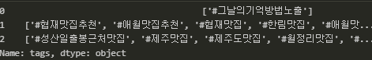
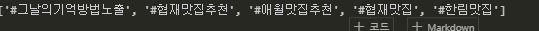
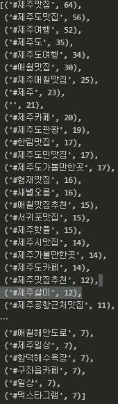
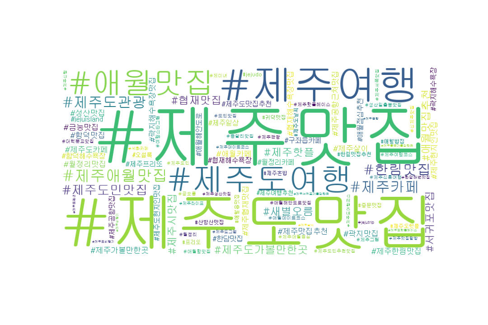

### 워드 클라우드

앞서 수집한 데이터 중 해시태그 정보들을 워드 클라우드로 시각화한다. 워드 클라우드란 **텍스트 내에서 출현하는 단어들의 출현 빈도수에 비례하는 크기로 표출한 그래프**이다. 제주도 맛집 관련 태그로 워클을 그리면 제주도의 핫플을 쉽게 파악할 수 있다.

---


##### 5.9 워드 클라우드 만드는 과정

해시태그 데이터를 불러와서 분석에 불필요한 데이터들은 제거하고 주요 데이터로만 워드 클라우드를 만든다.

```python
# 불러오기
raw_total = pd.read_excel('C:/Users/yj/Desktop/crawling_raw.xlsx')
```



```python
# 해시태그 통합 저장
tags_total = []
for tags in raw_total['tags']:			# 데이터의 태그 정보를 하나씩 가져와서
    tags_list = tags[2:-2].split("', '")# 키워드(#~)를 분리하여 tags_list 변수에 할당
    for tag in tags_list:				# 분리된 키워드 하나하나를 total 리스트에 저장
        tags_total.append(tag)
```



---


##### 5.10 해시태그 출현 빈도 집계

게시글 속에서 많이 언급된 해시태그를 찾는다. 빈도수를 기준으로 상위 해시태그 중 분석 과정에 불필요한 해시태그는 제외하고 분석을 진행한다.

```python
from collections import Counter
tag_counts = Counter(tags_total) # Counter 함수를 사용하여 원소의 종류별로 개수를 집계
tag_counts.most_common(50) # most_common() 메소드는 (상위 ~ 까지) 가장 많이 사용된 원소를 구해줌
```



데이터를 정제한다.

```python
# 제주도 맛집과 무관한 해시태그를 저장
stopwords = ['#일상','#선팔','#제주도','#jeju','#제주','#좋아요','#먹스타그램','#소통','#맞팔']

tag_total_selected = []	# stopwords에 속하지 않는 해시태그들만 다시 저장
for tag in tags_total:
    if tag not in stopwords:
        tag_total_selected.append(tag)
```

---


##### 5.11 워드 클라우드 그리기

```python
import matplotlib.pyplot as plt
from wordcloud import WordCloud
import platform

if platform.system() == 'Windows':	# 폰트 적용/window 이므로 이것만 설정함
    font_path = 'C:/Windows/Fonts/mgulim.ttc'
   
wordcloud = WordCloud(font_path= font_path,		# 폰트
                      background_color='white', # 배경색
                      max_words=100,			# 최대 몇개의 단어를 나타낼 것인지
                      relative_scaling=0.3,		# 글자들의 상대적인 크기
                      width=800,				# width, height 이미지 크기
                      height=400).generate_from_frequencies(tag_counts_selected)

plt.figure(figsize=(15,10))						# 최종 출력물의 크기
plt.imshow(wordcloud)
plt.axis('off')
plt.savefig('C:/Users/yj/Desktop/tag-wordcloud.png')
```



---

