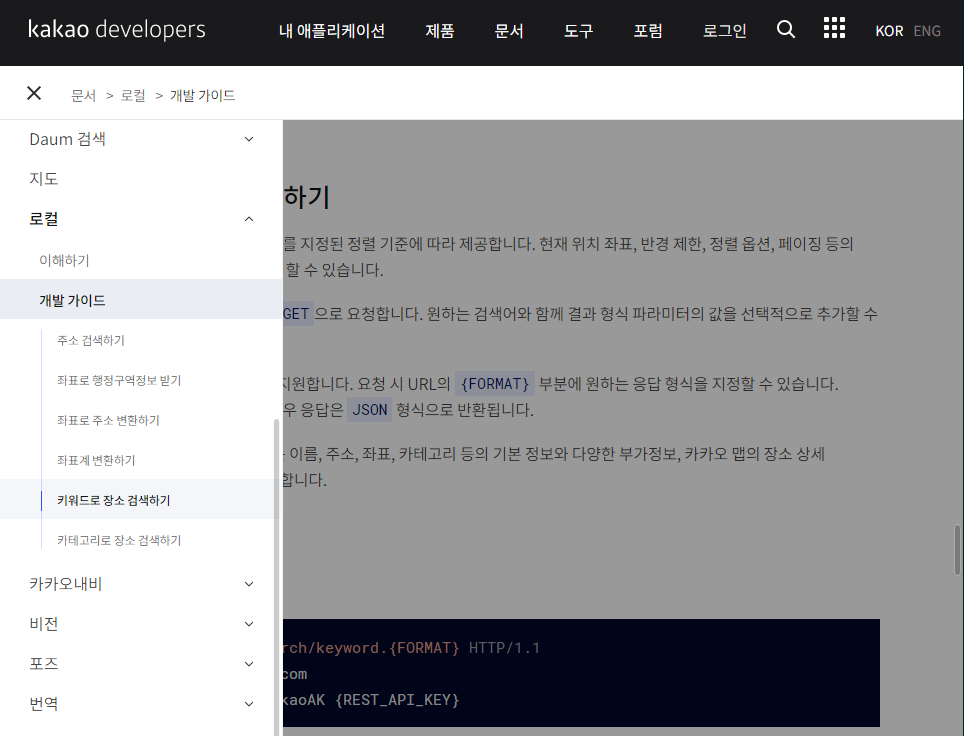
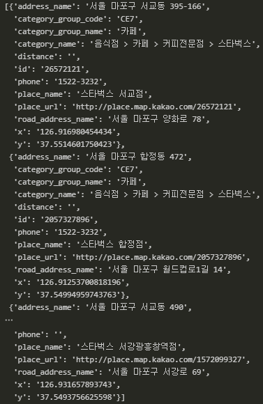
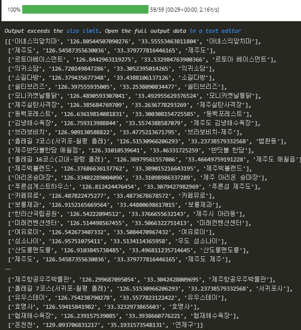
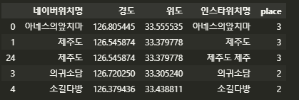
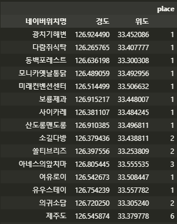

## 지도 시각화

위치 저보를 수집한 뒤, 카카오 API를 활용해 위도/경도 좌표로 변환하고 folium 라이브러리를 활용해 지도에 표시해보자.

##### 1. 데이터 준비

```python
# 데이터 불러오기
import pandas as pd
raw_total = pd.read_excel('C:/Users/yj/Desktop/crawling_raw.xlsx')

# 위치 정보 가져오기
location_counts = raw_total['place'].value_counts() # value_counts() 함수를 통해 빈도수를 집계

# 등록된 위치 정보별 빈도수 데이터 프레임 생성
location_counts_df = pd.DataFrame(location_counts)

# 저장
location_counts_df.to_excel('C:/Users/yj/Desktop/location_counts.xlsx')

# 위치 정보만 선택, list에 저장
locations = list(location_counts.index)
```

---


##### 2. 카카오 검색 API 가입

https://developers.kakao.com 에 접속한 후 가입. 위치 정보를 찾기 위해 [제품] -> [지도/로컬] -> [문서보기] -> [개발 가이드] 로 이동하여 API 사용 및 개발 도움말을 볼 수 있다.



- [내 애플리케이션] -> [애플리케이션 추가하기] 하여 API 사용 권한을 신청.
- 완료 즉시 앱이 생성되며 상세 정보에서 API를 사용할 때 필요한 키 값을 확인할 수 있음.
- 지금은 REST API 키 사용. 이 키는 본인임을 인증하는 비번에 해당하므로 외부에 노출되지 않도록 주의.

---


##### 3. 카카오 로컬 API를 활용한 장소 검색

```python
# 예로 합정 스타벅스를 검색

import requests

searching = '합정 스타벅스'
url = 'https://dapi.kakao.com/v2/local/search/keyword.json?query={}'.format(searching)

headers = {
    "Authorization": "KakaoAK *"   # 입력시 KakaoAK 뒤에 반드시 한칸 띄우고 API키를 적어야함. 
}

places = requests.get(url,headers=headers).json()['documents']
 # url에 정보를 요청함.
 # 이때 header에 저장된 카카오 REST API 키 값을 점검하고, 인증에 문제가 없다면 요청한 정보를 결과로 받을 수 있다.
 # 이 결과는 json 형태로 돼 있어 json()으로 읽으며, 이 데이터 중 검색 결과가 들어 있는 documents 항목 값을 선택한다.
```



하나의 검색어에 대해 여러 개의 검색 결과를 확인할 수 있고, 정확도가 높다고 판단되는 장소부터 정렬돼 있다. 이를 사용하여 함수를 만든다.

```python
# 검색어인 searching에 대해 카카오 로컬 API를 활용해 장소 정보를 찾는 함수

def find_places(searching):
    url = 'https://dapi.kakao.com/v2/local/search/keyword.json?query={}'.format(searching)
    
    headers = {
    "Authorization": "KakaoAK *"
    }
    
    places = requests.get(url, headers = headers).json()['documents']
    
    # 필요한 정보 선택하기
    place = places[0]
    name = place['place_name']
    x = place['x']
    y = place['y']
    
    data = [name, x, y, searching]
    
    return(data)

# 테스트
data = find_places('제주공항')
>>>
['제주국제공항', '126.492769004244', '33.5070789578184', '제주공항']
```

이를 통해 인스타에서 수집한 게시글의 모든 위치에 대해 위도, 경도를 추가해서 지도 시각화에 필요한 데이터로 정리한다.

```python
# 인스타 위치명에 대한 위치 정보 검색

import time
from tqdm import tqdm_notebook

locations_inform = []

for location in tqdm(locations):
    try:
        data = find_places(location)
        locations_inform.append(data)
        time.sleep(0.5)	# 과도한 요청 때문에 오류를 발생시킬 가능성을 방지
    except:
        pass
```



```python
# 저장
locations_inform_df = pd.DataFrame(locations_inform)
locations_inform_df.columns = ['네이버위치명','경도','위도','인스타위치명']
locations_inform_df.to_excel('./locations.xlsx', index=False)
```

---


##### 4. 위치 정보별 인스타 게시량 정리

지도에 위치 정보를 표시할 때 해당 게시글이 얼마나 많은지를 표시.

```python
# 인스타 게시량 및 위치 정보 데이터 불러오기

location_counts_df = pd.read_excel('./location_counts.xlsx', index_col= 0)
location_inform_df = pd.read_excel('./locations.xlsx')

# 위치 데이터 병합
# how 설정으로 양쪽에 모두 있는 데이터만 포함
# left_on 을 지정해 왼쪽에 위치한 locations_inform_df 데이터에서 '네이버 위치명' 칼럼의 데이터를 기준으로 병합
location_data = pd.merge(locations_inform_df,location_counts_df, how = 'inner',left_on = '네이버위치명', right_index = True)
```



```python
# 중복 데이터 점검
location_data['네이버위치명'].value_counts()
```

동일한 이름을 가진 장소들을 확인했으면 네이버위치명,경도,위도 데이터를 기준으로 동일한 장소는 게시 횟수를 합계로 정리한다.

```python
# 장소 이름 기준 병합
# index 값이 모두 동일할 경우 place 값을 병합하도록 설정
location_data = location_data.pivot_table(
index = ['네이버위치명','경도','위도'],
values = 'place',
aggfunc = 'sum')

# 저장
location_data.to_excel('./location_inform.xlsx',index=False)
```




 