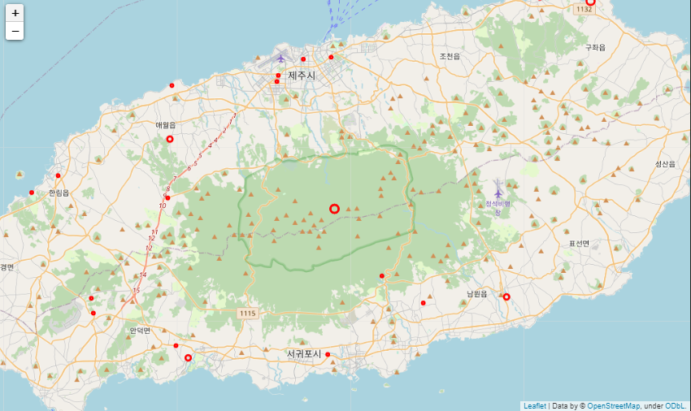
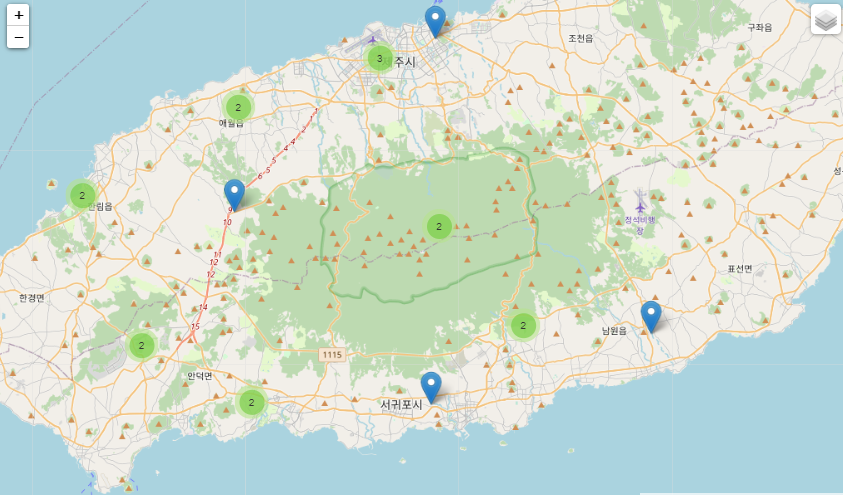
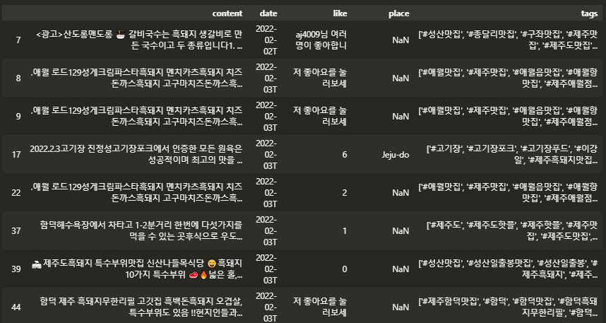
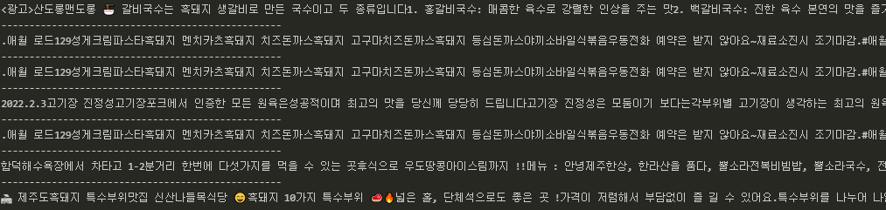

#### foilum을 이용한 지도 시각화

##### 1.  개별 표시

```python
location_data = pd.read_excel('./location_inform.xlsx')


import folium

Mt_Hanla = [33.362500, 126.533694]  # 한라산 좌표
map_jeju = folium.Map(location = Mt_Hanla,
                     zoom_start = 11)


for i in range(len(location_data)):
    name = location_data['name_official'][i]
    count = location_data['place'][i]   # 게시글 개수
    size = int(count)*2
    lng = location_data['위도'][i]
    lat = location_data['경도'][i]
    folium.CircleMarker(location = [lng, lat],
                       radius = size,
                       color = 'red',
                       popup = name).add_to(map_jeju)
```



```python
map_jeju.save('./jeju.html')
```

결과물을 HTML 파일로 저장하면 브라우저로 열어 확대/축소 등의 동작을 수행할 수 있다.

---


##### 2. 그룹으로 표시

위의 서클 마커들을 인접한 서클 마커들끼리 그룹으로 묶어서 표시.

```python
from folium.plugins import MarkerCluster


locations=[]
names=[]

for i in range(len(location_data)):
    data = location_data.iloc[i]	# 행 하나씩
    locations.append([data['위도'], data['경도']])	# 위도 , 경도 순으로
    names.append(data['name_official'])
    
Mt_Hanla = [33.362500, 126.533694]
map_jeju2 = folium.Map(location = Mt_Hanla, zoom_start = 11)

marker_cluster = MarkerCluster(locations = locations,
                               popups = names,
                               name = 'Jeju',
                               overlay=True,
                               control = True,
                              )
marker_cluster.add_to(map_jeju2)
folium.LayerControl().add_to(map_jeju2)
```



그룹 내에 몇 개의 마커가 있는지 표시해줌. 지도를 확대하거나 특정 그룹을 클릭할 경우 해당 위치가 확대되며 상세 내용을 확인할 수 있다.

---


#### 특정 단어를 포함한 게시글 찾기

##### 1. 원하는 게시글 찾기

수집한 데이터 중에서 특정 단어를 포함하는 게시글을 찾는다.


##### 2. 데이터 준비

```python
import pandas as pd
raw_total = pd.read_excel('C:/Users/yj/Desktop/crawling_raw.xlsx')
```


##### 3. 단어 선택하기

```python
select_word = '흑돼지'

check_list = []

for content in raw_total['content']:	# content 칼럼에서 흑돼지를 포함하는 index를 저장
    if select_word in content:
        check_list.append(True)
    else:
        check_list.append(False)

select_df = raw_total[check_list]
```



```python
# 선택한 데이터 확인
for i in select_df.index:
    print(select_df.loc[i, 'content'])
    print('-'*50)
select_df.head()
```



```python
# 저장
# 해당 변수명으로 파일 이름 저장
fpath = f'C:/Users/yj/Desktop/select_data_{select_word}.xlsx'
select_df.to_excel(fpath)
```


##### 단어 여러개 선택

```python
select_word_list = ['흑돼지','돈까스','맛집']

for select_word in select_word_list:
    check_list = []
    for content in raw_total['content']:
        if select_word in content:
            check_list.append(True)
        else:
            check_list.append(False)

select_df = raw_total[check_list]
fpath = f'C:/Users/yj/Desktop/select_data_{select_word}.xlsx'
select_df.to_excel(fpath)
```

해당 단어를 포함한 content 내용이 각각의 개별 파일에 저장된다.