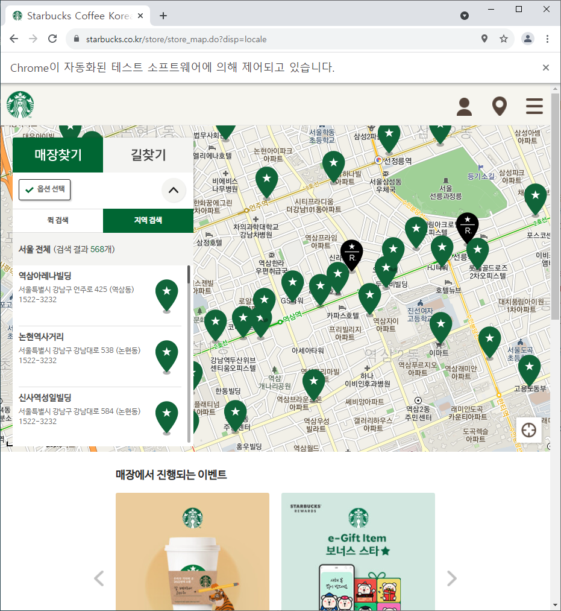
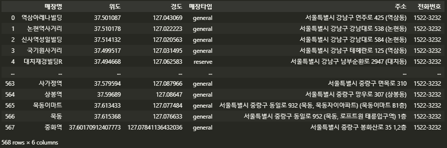

## 스타벅스의 입점 전략

**스타벅스가 어떤 전략으로 매장 입지를 선택하는지 분석한다.** 다음과 같이 스타벅스의 매장 입지에 대한 두 가지 가설을 먼저 세워본다.


1. **거주 인구가 많은 지역에 입점할 것이다.**
2. **직장인이 많은 지역에 입점할 것이다.**


#### 데이터 수집
스타벅스 코리아 홈페이지에 접속하여 https://www.starbucks.co.kr/store/store_map.do?disp=locale 에서 데이터를 수집한다. 해당 페이지에서 '서울' 버튼을 클릭해야 하기에 개발자 도구를 실행하여 '서울'버튼이 어디 있는지 찾는다. 그리고 '서울' 버튼에 해당하는 **태그의 구조 정보(CSS selector)**를 복사한다.
```python
seoul_btn = '#container > div > form > fieldset > div > section > article.find_store_cont > article > article:nth-child(4) > div.loca_step1 > div.loca_step1_cont > ul > li:nth-child(1) > a'
driver.find_element_by_css_selector(seoul_btn).click()
```
위 코드를 실행하면 '서울' 버튼이 클릭되어 다음 페이지를 볼 수 있다. ※ 해당 페이지에 위치해야 한다 ※

```python
all_btn = '#mCSB_2_container > ul > li:nth-child(1) > a'
driver.find_element_by_css_selector(all_btn).click()
```
마찬가지로 '전체' 버튼을 클릭하는 코드를 생성하고 실행하면 전체 버튼이 클릭된 페이지를 볼 수 있다.



---

스타벅스 매장 목록이 왼쪽 창에 나타난다. 검색 결과로 568개의 스타벅스 매장의 명칭, 주소, 전화번호 등을 추출해 본다.

```python
## BeautifulSoup으로 HTML 파서 만들기
html = driver.page_source
soup = BeautifulSoup(html, 'html.parser')
```
`driver.page_source`를 통해 크롬 브라우저의 현재 화면에 나타난 웹 페이지의 HTML을 가져올 수 있다. `BeautifulSoup(html, 'html.parser')`에서 **html.parser** 는 <u>HTML 문법을 이해하고 웹 페이지의 정보를 분류하는 역할</u>을 한다.

매장 리스트에서 '지점명'에 해당하는 태그를 확인하여 추출하고 **첫 번째 원소의 데이터**를 살펴본다.
```python
starbucks_soup_list = soup.select('li.quickResultLstCon')
starbucks_soup_list[0]
```
```tex
>>>
<li class="quickResultLstCon" data-code="3762" data-hlytag="null" data-index="0" data-lat="37.501087" data-long="127.043069" data-name="역삼아레나빌딩" data-storecd="1509" style="background:#fff">
<strong data-my_siren_order_store_yn="N" data-name="역삼아레나빌딩" data-store="1509" data-yn="N">역삼아레나빌딩  </strong>
<p class="result_details">서울특별시 강남구 언주로 425 (역삼동)<br/>1522-3232</p>
<i class="pin_general">리저브 매장 2번</i></li>
```
해당 데이터 정보를 보고 값들을 추출해본다.

```python
startbucks_store = starbucks_soup_list[0]
name = startbucks_store.select('strong')[0].text.strip()
lat = startbucks_store['data-lat'].strip()
lng = startbucks_store['data-long'].strip()
store_type = startbucks_store.select('i')[0]['class'][0][4:] ## <i> 태그의 class 값인 'pin_general'의 'general' 부분만 변수에 저장함.
address = str(startbucks_store.select('p.result_details')[0]).split('<br/>')[0].split('>')[1]
tel = str(startbucks_store.select('p.result_details')[0]).split('<br/>')[1].split('<')[0]

print(name)         # 매장명
print(lat)          # 위도
print(lng)          # 경도
print(store_type)   # 매장 타입
print(address)      # 주소
print(tel)          # 전화번호
```

```tex
>>>
역삼아레나빌딩
37.501087
127.043069
general
서울특별시 강남구 언주로 425 (역삼동)
1522-3232
```

---


이제 **서울시 스타벅스 매장 목록 데이터**를 추출해서 만들고, 데이터프레임으로 형태를 짭니다.

```python
starbucks_list = []
# starbucks_soup_list = soup.select('li.quickResultLstCon')

for item in starbucks_soup_list:
    name = item.select('strong')[0].text.strip();
    lat = item['data-lat'].strip()
    lng = item['data-long'].strip()
    store_type = item.select('i')[0]['class'][0][4:]
    address = str(item.select('p.result_details')[0]).split('<br/>')[0].split('>')[1]
    tel = str(item.select('p.result_details')[0]).split('<br/>')[1].split('<')[0]
    
    starbucks_list.append( [ name, lat, lng, store_type, address, tel])

columns = ['매장명','위도','경도','매장타입', '주소','전화번호']
seoul_starbucks_df = pd.DataFrame(starbucks_list, columns = columns)
```



데이터 프레임을 엑셀로 저장한다.

```python
seoul_starbucks_df.to_excel('./files/seoul_starbucks_list.xlsx', index=False)
```


다음 장에서 가설을 검증하기 위한 작업을 진행한다.
