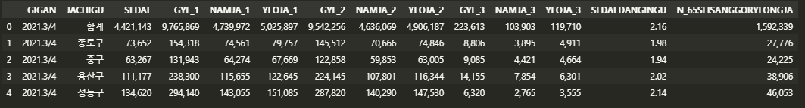
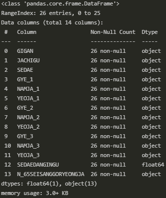
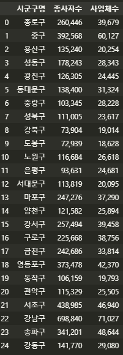

#### 1번 가설 검증하기

---

앞서 스타벅스 입점 전략에 대한 가설을 세웠는데 그 중 1번(**거주 인구가 많은 지역에 입점할 것이다.**) 을 증명하기 위해 데이터 분석을 진행한다. 일단 서울시 시군구별 인구 데이터를 가져와 데이터 프레임화 시켰다.

```python
sgg_pop_df = pd.read_csv('./files/report.txt', sep='\t', header=2)
columns = {
    '기간': 'GIGAN',
    '자치구': 'JACHIGU',
    '계': 'GYE_1',
    '계.1': 'GYE_2',
    '계.2': 'GYE_3',
    '남자': 'NAMJA_1',
    '남자.1': 'NAMJA_2',
    '남자.2': 'NAMJA_3',
    '여자': 'YEOJA_1',
    '여자.1': 'YEOJA_2',
    '여자.2': 'YEOJA_3',
    '세대': 'SEDAE',
    '세대당인구': 'SEDAEDANGINGU',
    '65세이상고령자': 'N_65SEISANGGORYEONGJA'
}
sgg_pop_df.rename(columns = columns, inplace = True)
```





결과에서 'JACHIGU' 칼럼의 첫 번째 값이 합계인 것을 확인할 수 있다. 그래서 25개의 자치구에 합계가 합쳐져 총 26개의 데이터가 조회된 것이다. 합계는 필요없으므로 데이터를 제거한다.

```python
condition = sgg_pop_df['JACHIGU'] != '합계'
sgg_pop_df_selected = sgg_pop_df[condition]
```

이제 필요한 칼럼만 추출해 다시 데이터프레임을 만든다. 이후 분석에 필요한 JACHIGU, GYE_1 칼럼만으로 데이터프레임을 만든다. 네임도 변경해준다. 그리고 엑셀로 저장한다.

```python
sgg_pop_df_final = sgg_pap_df_selected['JACHIGU','GYE_1']
sgg_pop_df_final.columns = ['시군구명', '주민등록인구']
```

```python
sgg_pop_df_final.to_excel('./files/sgg_pop.xlsx', index=False)
```

---


#### 2번 가설 검증하기

---

다음은 2번 가설(**직장인이 많은 지역에 입점할 것이다.**)를 검증한다. 이를 위해서 서울시 사업체현황 통계 데이터를 분석한다. 이번에는 시군구별 통계가 필요하기 때문에 위의 과정과 마찬가지로 불필요한 데이터는 삭제하고, 분석에 필요한 DONG 칼럼의 값이 '소계'인 것만 추출한다.

``` python
sgg_biz_df = pd.read_csv('./files/report2.txt', sep='\t', header=2)
columns = {
    '기간': 'GIGAN',
    '자치구': 'JACHIGU',
    '동': 'DONG',
    '사업체수': 'SAEOPCHESU_1',
    '여성대표자': 'YEOSEONGDAEPYOJA',
    '계': 'GYE',
    '남': 'NAM',
    '여': 'YEO'
}
sgg_biz_df.rename(columns = columns, inplace = True)


# 시군구별 사업체 현황 데이터 추출
condition = sgg_biz_df['DONG'] == '소계'
sgg_biz_df_selected = sgg_biz_df[condition]

# 필요없는 칼럼 제거, rename
sgg_biz_df_final = sgg_biz_df_selected ['JACHIGU', 'GYE', 'SAEOPCHESU_1']
sgg_biz_df_final.columns = ['시군구명', '종사자수','사업체수']

# 데이터프레임의 인덱스 초기화
sgg_biz_df_final = sgg_biz_df_final.reset_index(drop=True)

# 엑셀로 저장
sgg_biz_df_final.to_excel('./files/sgg_biz.xlsx', index=False)
```


