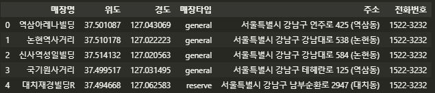
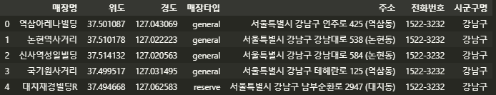
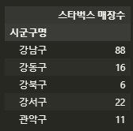
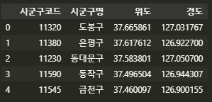
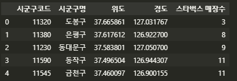
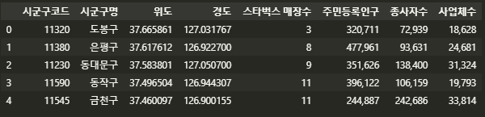

#### 서울시 스타벅스 매장 목록, 인구, 사업체 데이터에 시군구명, 시군구코드 추가

---

수집한 데이터를 이용하기에 앞서 두 가지 가정을 검토한다. 이때 필요한 것은 서울시 지역별 스타벅스 매장 수, 인구수, 사업체 수이며, 여기서는 시군구를 기준으로 분석한다. 두 개 이상의 데이터를 병합하기 위해서는 공통된 기준값이 필요하며, 이를 **키(key)**라고 한다. 즉, `시군구`를 키 값으로 하여 데이터를 병합한다.

1. 먼저 스타벅스 매장 목록이 담긴 엑셀 파일(`seoul_starbucks_list`) 을 불러와서
2. '시군구명' 정보를 추출하여 새 리스트에 할당한다.
3. 새로운 칼럼을 생성하여 '시군구명' 정보를 저장한다

```python
## 1
import pandas as pd
seoul_starbucks = pd.read_excel('./files/seoul_starbucks_list.xlsx',header = 0)
```



```python
## 2
ssg_names = []

for address in seoul_starbucks['주소']:
    ssg = address.split()[1]
    ssg_names.append(ssg)

## 3
seoul_starbucks['시군구명'] = ssg_names
```



```python
## 엑셀로 저장
seoul_starbucks.to_excel('./files/seoul_starbucks_list.xlsx', index=False)
```

위의 엑셀 파일에는 시군구명 정보가 담겨 있기 때문에 이 데이터에서 시군구별 매장 수를 알 수 있다. 이를 계산하기 위해 `pivot_table()` 함수를 사용한다.

```python
starbucks_ssg_count = seoul_starbucks.pivot_table(values='매장명',index='시군구명',aggfunc='count')
starbucks_ssg_count = starbucks_ssg_count.rename(columns={'매장명':'스타벅스 매장수'})
```



이제 이 데이터를 서울시 시군구 목록 데이터와 병합한다.

```python

seoul_ssg = pd.merge(seoul_ssg)
```


---


#### 스타벅스 분석 데이터 만들기

앞서 스타벅스 매장 리스트에 시군구명 정보를 추가했으므로 이 정보를 이용해 시군구목록 데이터에 시군구별 스타벅스 매장 수, 주민인구, 사업체 수 통계 데이터를 병합한다. 병합할 데이터의 중심이 될 서울시 시군구 목록 데이터를 불러온다.

```python
seoul_ssg = pd.read_excel('C:/Users/yj/Desktop/datasalon/6_Starbucks_Location/files/seoul_ssg_list.xlsx')
```



이제 이 데이터에 스타벅스 매장 수 데이터를 병합한다.

```python
seoul_ssg = pd.merge(seoul_ssg, starbucks_ssg_count, how = 'left', on = '시군구명')
```



서울시 시군구 목록 데이터의 맨 오른쪽에 ''스타벅스 매장수'' 칼럼이 병합된 것을 확인할 수 있다. 이제 동일한 방식으로 시군구별 주민인구, 사업체 통계 데이터를 불러와 병합한다.

```python
seoul_ssg = pd.merge(seoul_ssg, seoul_ssg_pop, how = 'left', on = '시군구명')
seoul_ssg = pd.merge(seoul_ssg, seoul_ssg_biz, how = 'left', on = '시군구명')
```



이로써 모든 병합 과정을 마쳤다. 

```python
## 저장
seoul_ssg.to_excel('./files/seoul_ssg_stat.xlsx',index=False)
```

