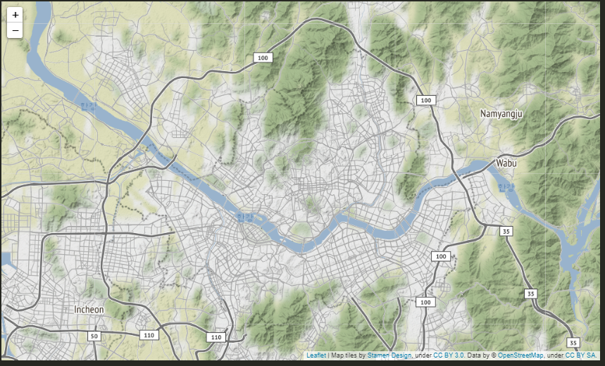
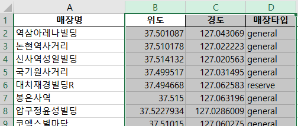
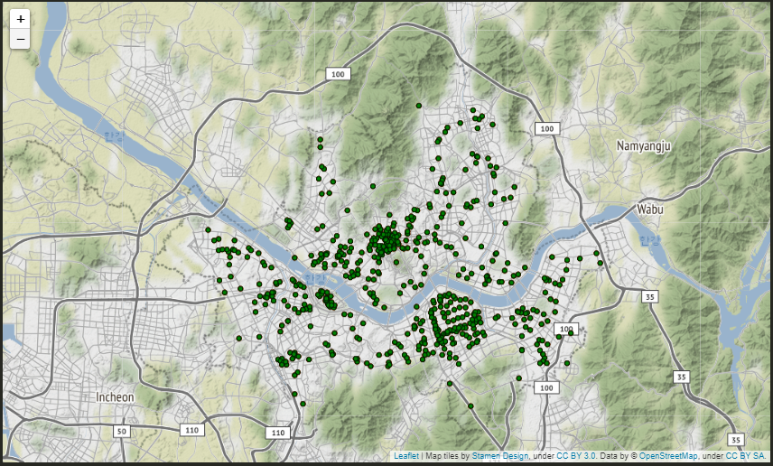
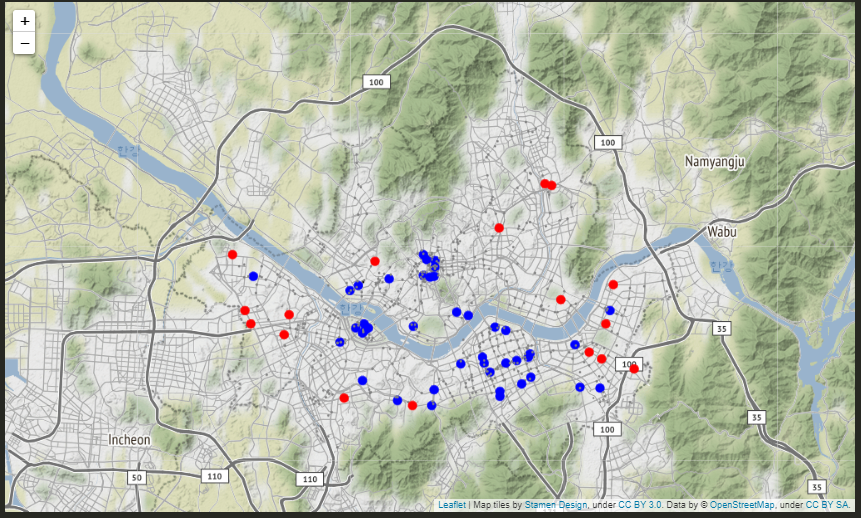
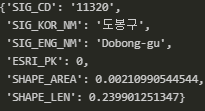
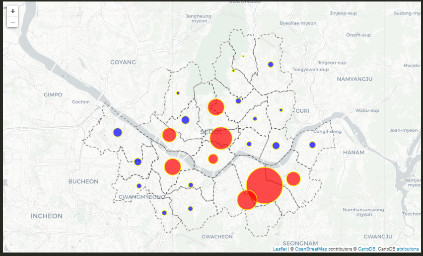
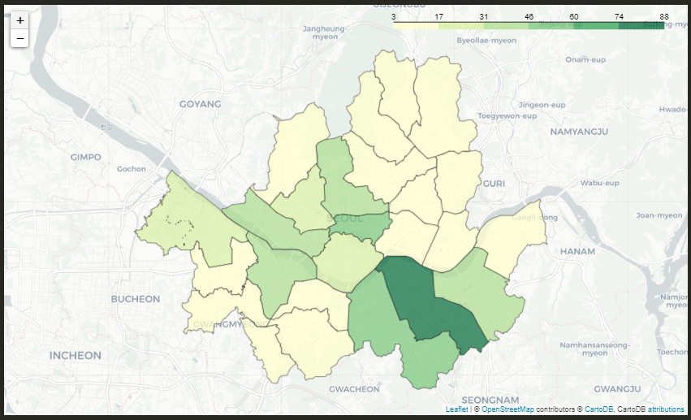
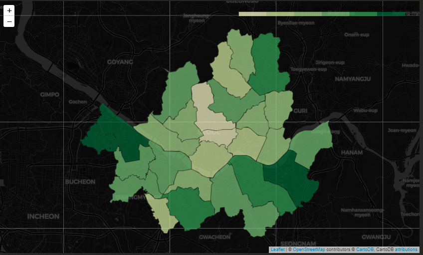
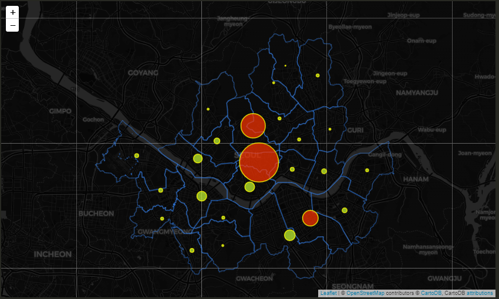
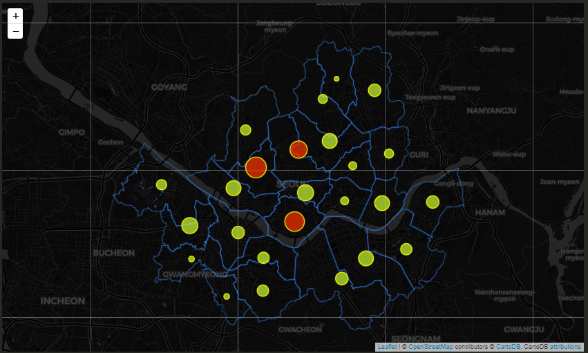

### 시각화

---

### 스타벅스 매장분포

```python
import pandas as pd
import folium		# 데이터를 지도에 시각화하기 위한 라이브러리
import json			# GeoJson 타입의 지도 파일을 사용하기 위함
```

```python
seoul_starbucks = pd.read_excel('./files/seoul_starbucks_list.xlsx')

starbucks_map = folium.Map(
    location=[37.573050, 126.979189],
    tiles='Stamen Terrain',
    zoom_start=11
)
starbucks_map
```



- foilum의 **`Map()`**을 이용해 기본 지도를 생성한다.
- **지도의 중심 위치 좌표**를 리스트 타입으로 location항목에 입력한다.
- 배경이 되는 지도를 **tiles**에 입력한다. **tile** 이란 네이버 지도, 카카오맵과 같은 지도의 종류를 의미한다. folium에서 지원하는 지도 tile의 종류 7종 중 'Stamen Terrain'을 사용했다.
- **최초 지도 줌 레벨**을 나타내는 **zoom_start**로는 11을 지정했다.


---

```python
for idx in seoul_starbucks.index:
    lat = seoul_starbucks.loc[idx, '위도']
    lng = seoul_starbucks.loc[idx, '경도']

    folium.CircleMarker(
        location=[lat, lng],		# location 항목에 위도/경도 입력
        fill = True, 				# 색을 채울 것 인지
        fill_color='green', 		
        fill_opacity=1,				# 투명도
        color='black', 				# 외곽선 색
        weight=1,					# 외곽선 두께
        radius=3					# 반지름 크기
    ).add_to(starbucks_map)

starbucks_map
```





- for 문을 통해 **위도/경도** 값을 하나씩 추출했다.
- 추출된 위도/경도 값을 folium의 **`CircleMarker()`**의 **location** 항목에 입력하고, 내부 색상, 투명도, 외곽선 색상, 두께, 반지름 크기를 입력했다.
- 마지막으로 **`add_to()`** 함수를 이용해 folium 지도가 들어가 있는 변수인 starbucks_map에 추가한다.


**종로구, 강남구에 스타벅스 매장이 매우 많이 분포했음을 볼 수 있다.**


---

#### 스타벅스 매장 타입별 위치 서클 마커


```python
starbucks_map2 = folium.Map(
    location=[37.573050, 126.979189],
    tiles='Stamen Terrain',
    zoom_start=11
)

for idx in seoul_starbucks.index:
    lat = seoul_starbucks.loc[idx, '위도']
    lng = seoul_starbucks.loc[idx, '경도']
    store_type = seoul_starbucks.loc[idx, '매장타입']
    
    # 매장 타입별 색상 선택을 위한 조건문
    fillColor = ''
    if store_type == 'general':
        fillColor = 'gray'
        size = 1
    elif store_type == 'reserve':
        fillColor = 'blue'
        size = 5
    elif store_type == 'generalDT':
        fillColor = 'red'
        size = 5

    folium.CircleMarker(
        location=[lat, lng],
        color=fillColor,
        fill = True,
        fill_color = fillColor, 
        fill_opacity = 1,
        weight = 1,
        radius = size
    ).add_to(starbucks_map2)

starbucks_map2
```



- starbucks_map2 변수에 새로운 folium 지도를 할당하고 반복문으로 위도/경도/매장타입을 가져왔다.
- 비어 있는 변수인 **fillColor**를 선언하고 if 문을 사용하여 매장타입별로 색과 크기를 다르게 했다.
- 타입별 매장의 위치를 **`CircleMarker()`**로 **서클마커**로 만들고 **`add_to()`** 함수를 실행해 folium 지도에 추가했다.


**리저브 매장은 대체로 서울 중심지에 위치했고, 드라이브 스루 매장은 대체로 서울 외곽에 위치한 것을 볼 수 있다.**

---

---

---


### 시군구별 스타벅스 매장 수

어느 구에 스타벅스 매장이 많이 위치해 있는지 살펴보자.

```python
import pandas as pd
import folium
import json

seoul_ssg_stat = pd.read_excel('./files/seoul_ssg_stat.xlsx')

sgg_geojson_file_path = './maps/seoul_sgg.geojson'
seoul_sgg_geo = json.load(open(sgg_geojson_file_path, encoding='utf-8'))
seoul_sgg_geo['features'][0]['properties']
```



- 스타벅스 매장 수 데이터를 불러오고 서울시 시군구 행정 경계 지도를 시각화할 수 있는 예제 파일(geojson)을 실행했다. 확장자가 .geojson인 파일은 지도 데이터를 저장하기 위한 국제 표준 포맷이다. 
- json 타입의 데이터와 상응하는 딕셔너리 타입의 데이터로 구성된다. 이 딕셔너리 안에 저장된 지도 속성 정보 하나를 살펴보면 서울시 행정 경계 지도에서 하나의 시군구 데이터에는 시군구 코드가 **'SIG_CD'** 키의 값으로, 시군구명은 **'SIG_KOR_NM'**의 키의 값으로 저장돼 있다.

```python
# folium Map 생성
starbucks_bubble = folium.Map(
    location=[37.573050, 126.979189], tiles ='CartoDB positron' , zoom_start=11 )

# 시군구 경계 지도 그리기
def style_function(feature):
    return {
        'opacity': 0.7,
        'weight': 1,
        'color': 'white',
        'fillOpacity':0,
        'dashArray': '5, 5',
    }

folium.GeoJson(
    seoul_ssg_geo,
    style_function=style_function
).add_to(starbucks_bubble)
```


- 배경 지도로 `CartoDB positron`를 이용했다.
- `style_function` 함수는 geojson 포맷의 지도 데이터를 지도에 표시할 때 스타일을 지정하는 함수이다.
- 함수 내용을 설정하고 foilum의 geojson()의 style_function 항목에 지정했다.
- geojson()의 첫 번째 매개변수에 앞에서 불러온 지도 파일 변수인 seoul_ssg_geo를 입력했다.


#### 버블 지도 시각화

```python
# 시군구별 스타벅스 평균 매장 수 계산
starbucks_mean = seoul_ssg_stat['스타벅스 매장수'].mean() # >>> 22.72

# 시군구별 스타벅스 매장 수를 버블 지도로 시각화
for idx in seoul_ssg_stat.index:
    lat = seoul_ssg_stat.loc[idx, '위도']
    lng = seoul_ssg_stat.loc[idx, '경도']
    count = seoul_ssg_stat.loc[idx, '스타벅스 매장수']

    if count > starbucks_mean:
        fillColor = 'red'
    else:
        fillColor = 'blue'
    
    folium.CircleMarker(
        location=[lat, lng], 
        color='#FFFF00',
        fill_color=fillColor, 
        fill_opacity=0.7,
        weight=1.5,
        radius=count/2
    ).add_to(starbucks_bubble)
```



- 서울시 시군구 스타벅스 **매장 수의 평균**을 구하였다.
- **`CircleMaker()`,`add_to()`**함수를 사용하여 위에서 생성한 시군구 경계선 folium 지도에 서클을 생성했다.
- 매장수가 평균보다 높은 구는 **red**, 적은 구는 **blue**로 색을 채웠다.
- 반지름의 경우 숫자가 너무 큰 경우에 원이 너무 크게 표시되기 때문에 나누기를 통해 반지름을 줄였다.

---


#### 단계 구분도 시각화

```python
# 시군구별 스타벅스 매장 수를 단계구분도로 시각화
ssg_geojson_file_path = './maps/seoul_ssg.geojson'
seoul_ssg_geo_2 = json.load(open(ssg_geojson_file_path, encoding='utf-8'))
starbucks_choropleth = folium.Map(
    location=[37.573050, 126.979189],
    tiles='CartoDB positron',
    zoom_start=11
)

folium.Choropleth(
    geo_data=seoul_ssg_geo_2,
    data=seoul_ssg_stat,
    columns=['시군구명', '스타벅스 매장수'],
    fill_color = 'YlGn',
    fill_opacity=0.7,
    line_opacity=0.5,
    key_on='properties.SIG_KOR_NM'
    ).add_to(starbucks_choropleth)

starbucks_choropleth
```



- starbucks_choropleth에 folium 지도를 할당한다. folium에서 단계구분도는 **Choropleth()**를 이용해 시각화할 수 있다.
- **`Choropleth()`** 의 geo_data 항목에는 지도 데이터인 seoul_ssg_geo_2를 지정했고, data 항목에는 엑셀 파일인 데이터 seoul_ssg_stat을 지정했다.
- `colums` 항목에 두 개의 값을 리스트로 넣어줬는데, **첫 번째 값은 지도 데이터와 매칭되는 값**이어야 한다. 즉, 지도 데이터(seoul_ssg_geo_2)의 시군구 코드인 **'SIG_KOR_NM'**과 서울시 시군구별 통계 데이터(seoul_ssg_stat)의 **'시군구명'** 칼럼이 매칭되기 때문에 '시군구명'을 입력했다.
- key_on 항목에 **'properties.SIG_KOR_NM'**를 입력해 '시군구명' 칼럼과 매칭시켰다.

---

---

---


#### 스타벅스 매장 수와 인구수 비교

첫 번째 가설인 '거주 인구가 많은 지역에 스타벅스 매장이 많이 입지해 있을 것이다.'를 검증하기 위해 시군구별 스타벅스 매장 수와 사업체 종사자 수 사이의 관계를 알아본다.

```python
import pandas as pd
import folium
import json

# 서울시 시군구별 통계 데이터 로드
seoul_sgg_stat = pd.read_excel('./files/seoul_sgg_stat.xlsx', thousands = ',')

# 서울시 시군구 행정 경계 지도 파일 로드
sgg_geojson_file_path = './maps/seoul_sgg.geojson'
seoul_sgg_geo_2 = json.load(open(sgg_geojson_file_path, encoding='utf-8'))

# 서울시 시군구별 주민등록인구수 단계구분도 지도 시각화
starbucks_choropleth = folium.Map(
    location=[37.573050, 126.979189],
    tiles='CartoDB dark_matter',
    zoom_start=11
)

folium.Choropleth(
    geo_data=seoul_ssg_geo_2,
    data=seoul_ssg_stat,
    columns=['시군구명', '주민등록인구'],
    fill_color = 'YlGn',
    fill_opacity=0.7,
    line_opacity=0.5,
    key_on='properties.SIG_KOR_NM'
    ).add_to(starbucks_choropleth)
```



- `columns` 값에 '주민등록인구'를 넣었다.

**주민등록인구수는 강서구, 송파구, 관악구 쪽이 높은 것으로 나타났다.**

---


이 주민등록인구수와 매장 수는 어떤 관계에 있는지 확인해보기 위하여 **시군구별 인구 1만명당 스타벅스 매장 수**를 계산한다.

```python
# 인구 만 명당 스타벅스 매장 수 칼럼 추가
seoul_ssg_stat['만명당_매장수'] = seoul_ssg_stat['스타벅스 매장수']/(seoul_ssg_stat['주민등록인구']/10000)

# 인구 만 명당 스타벅스 매장 수 지도 시각화
ssg_GEOJSON_FILE_PATH = './maps/seoul_ssg.geojson'
seoul_ssg_geo_1 = json.load(open(ssg_GEOJSON_FILE_PATH, encoding='utf-8'))

viz_map_1 = folium.Map(
    location=[37.573050, 126.979189],
    tiles='CartoDB dark_matter',
    zoom_start=11
)

# 지도 스타일 지정 함수
def style_function(feature):
    return {
        'opacity': 0.7,
        'weight': 1,
        'fillOpacity':0,
    }

folium.GeoJson(
    seoul_ssg_geo_2,
    style_function=style_function,
).add_to(viz_map_1)

# 만명당 매장수 기준 상위 10% 추출 값
top = seoul_ssg_stat ['만명당_매장수'].quantile(0.9)
for idx in seoul_ssg_stat.index:
    lat = seoul_ssg_stat.loc[idx, '위도']
    lng = seoul_ssg_stat.loc[idx, '경도']
    r = seoul_ssg_stat.loc[idx, '만명당_매장수']
    if r > top:
        fillColor = '#FF3300' # (Red)
    else:
        fillColor = '#CCFF33' # (Green)
    
    folium.CircleMarker(
        location=[lat, lng], 
        color='#FFFF00',     # (Yellow)
        fill_color=fillColor, 
        fill_opacity=0.7,
        weight=1.5,
        radius= r * 10
    ).add_to(viz_map_1)

viz_map_1
```

- `top = seoul_ssg_stat ['만명당_매장수'].quantile(0.9)`은 **해당 칼럼의** **상위 10%(3개)**에 해당하는 값을 얻기 위한 코드이다.



앞서 인구 단계구분도에서 중구, 종로구는 주민등록인구가 적은 지역이지만 인구 1만 명당 스타벅스 매장 수는 가장 많은 것으로 표시된다. 즉, 첫 번째 가설이 틀렸음으로 판단된다.

---


#### 스타벅스 매장 수와 사업체 수 비교

두 번째 가설인 '직장인이 많은 지역에 스타벅스 매장이 많이 입지해 있을 것이다'를 검증한다. 마찬가지로 종자사 1만 명당 스타벅스 매장 수를 통해 확인한다.

```python
# 종사자 1만 명당 스타벅스 매장 수 칼럼 추가
seoul_ssg_stat['종사자수_만명당_매장수'] = seoul_ssg_stat['스타벅스 매장수']/(seoul_ssg_stat['종사자수']/10000)

# 종사자 수 1만 명당 스타벅스 매장 수 시각화
seoul_ssg_geo_1 = json.load(open(ssg_GEOJSON_FILE_PATH, encoding='utf-8'))

viz_map_1 = folium.Map(
    location=[37.573050, 126.979189],
    tiles='CartoDB dark_matter',
    zoom_start=11
)

folium.GeoJson(
    seoul_ssg_geo_1,
    style_function=style_function,
).add_to(viz_map_1)

top = seoul_ssg_stat['종사자수_만명당_매장수'].quantile(0.9)
for idx in seoul_ssg_stat.index:
    name = seoul_ssg_stat.at[idx, '시군구명']
    lat = seoul_ssg_stat.loc[idx, '위도']
    lng = seoul_ssg_stat.loc[idx, '경도']
    r = seoul_ssg_stat.loc[idx, '종사자수_만명당_매장수']
    
    if r > top:
        fillColor = '#FF3300'
    else:
        fillColor = '#CCFF33'
    
    folium.CircleMarker(
        location=[lat, lng], 
        color='#FFFF00', 
        fill_color=fillColor, 
        fill_opacity=0.7,
        weight=1.5,
        radius= r * 10
    ).add_to(viz_map_1)

viz_map_1
```



- 지도에서 원은 종사자수 만 명당 스타벅스 매장수를 의미하며, 붉은색 원은 상위 10%  지역이다.
- 상위 3개의 시군구와 나머지 시군구의 원 크기가 크게 차지 나지 않는다.
- 따라서 사업체 종사자 수와 스타벅스 매장 수가 대체로 비례한다고 할 수 있다. 가설 2는 어느 정도 타당한 것으로 보인다
