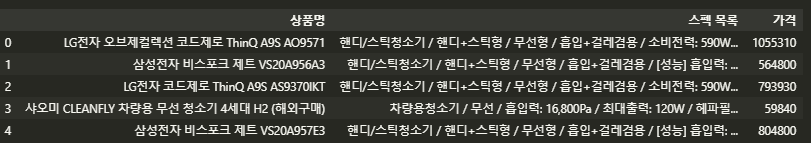
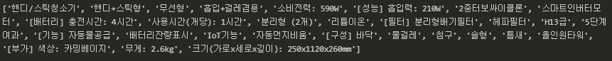
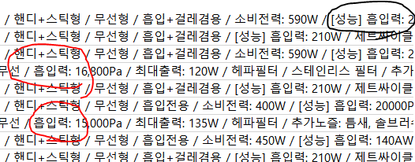
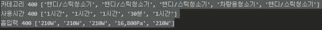
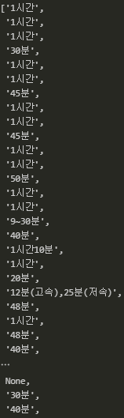

정보 비교 사이트인 ''다나와'' 에서 ''무선청소기에 대한 정보''를 비교해본다.


### 한 페이지 크롤링

---

먼저 1페이지에서 가장 첫 번째 무선청소기에 대한 정보를 추출해봤다.

```python
from selenium import webdriver
driver = webdriver.Chrome('./chromedriver.exe')
url = "http://search.danawa.com/dsearch.php?query=무선청소기&tab=main"
driver.get(url)	## url 접속

from bs4 import BeautifulSoup

html = driver.page_source					#웹 페이지의 html 정보 가져옴
soup = BeautifulSoup(html,'html.parser')
```

```python
## 1페이지에 대한 무선청소기 정보
prod_items = soup.select('div.main_prodlist > ul.product_list > li.prod_item')
>>>
44
```

```python
## 상품명 정보
title = prod_items[0].select('p.prod_name > a')[0].text.strip()
>>>
LG전자 오브제컬렉션 코드제로 ThinQ A9S AO9571
```
```python
## 스펙 목록 정보
spec_list = prod_items[0].select('div.spec_list')[0].text.strip()
>>>
핸디/스틱청소기 / 핸디+스틱형 / 무선형 / 흡입+걸레겸용 / 소비전력: 590W / [성능] 흡입력: 210W / 2중터보싸이클론 / 스마트인버터모터 / [배터리] 충전시간: 4시간 / 사용시간(개당): 1시간 / 분리형 (2개) / 리튬이온 / [필터] 분리형배기필터 / 헤파필터 / H13급 / 5단계여과 / [기능] 자동물공급 / 배터리잔량표시 / IoT기능 / 자동먼지비움 / [구성] 바닥 / 물걸레 / 침구 / 솔형 / 틈새 / 올인원타워 / [부가] 색상: 카밍베이지 / 무게: 2.6kg / 크기(가로x세로x깊이): 250x1120x260mm
```
```python
## 가격 정보
price = prod_items[0].select('li.rank_one > p.price_sect > a > strong')[0].text.strip().replace(",","")
>>>
1055260
```


반복문으로 검색 결과의 1페이지에 대한 모든 상품의 정보를 추출한다.

```python
## 반복문으로 검색 결과의 1페이지에 대한 상품 정보 추출

prod_data = []
for prod_item in prod_items:
    if 'product-pot' in prod_item['class']:
        continue  # 공백부분(‘li.prod_item.product-pot’) 제외하기
    try:
        ## 상품명 가져오기
        title = prod_item.select('p.prod_name > a')[0].text.strip()
        ## 스펙 목록 가져오기
        spec_list = prod_item.select('div.spec_list')[0].text.strip()
        ## 가격 정보 가져오기 
        price = prod_item.select('li.rank_one > p.price_sect > a > strong')[0].text.strip().replace(",", "")
        ## 데이터에 정보들 저장
        prod_data.append([title, spec_list, price])
    except:
        pass  # 진행시 에러가 발생할 경우(광고 상품 등) 넘어가기
```
상품 검색 결과가 여러 페이지에 걸쳐서 나오기 때문에 위의 코드를 함수로 만든다. 이 함수를 활용해 페이지별 상품 정보 수집을 진행한다.

```python
## 상품 정보 태그에서 원하는 정보를 추출하는 함수

def get_prod_items(prod_items):
    prod_data = []
    for prod_item in prod_items:
        if 'product-pot' in prod_item['class']:
            continue
        try:
            title = prod_item.select('p.prod_name > a')[0].text.strip()
            spec_list = prod_item.select('div.spec_list')[0].text.strip()
            price = prod_item.select('li.rank_one > p.price_sect > a > strong')[0].text.strip().replace(",", "")
            prod_data.append([title, spec_list, price])
        except:
            pass
    return prod_data
```
---


### 여러 페이지 크롤링

---

다나와 웹 사이트의 페이지에 대한 패턴을 찾는다.

```python
## 메인 페이지(무선 청소기를 검색했을 때 처음 페이지)
http://search.danawa.com/dsearch.php?query=%EB%AC%B4%EC%84%A0%EC%B2%AD%EC%86%8C%EA%B8%B0

## 1페이지 주소
http://search.danawa.com/dsearch.php?query=%EB%AC%B4%EC%84%A0%EC%B2%AD%EC%86%8C%EA%B8%B0&originalQuery=%EB%AC%B4%EC%84%A0%EC%B2%AD%EC%86%8C%EA%B8%B0&previousKeyword=%EB%AC%B4%EC%84%A0%EC%B2%AD%EC%86%8C%EA%B8%B0&volumeType=allvs&page=1&limit=40&sort=saveDESC&list=list&boost=true&addDelivery=N&recommendedSort=Y&defaultUICategoryCode=102207&defaultPhysicsCategoryCode=72%7C80%7C81%7C0&defaultVmTab=2606&defaultVaTab=390097&tab=goods
    
## 2페이지 주소
http://search.danawa.com/dsearch.php?query=%EB%AC%B4%EC%84%A0%EC%B2%AD%EC%86%8C%EA%B8%B0&originalQuery=%EB%AC%B4%EC%84%A0%EC%B2%AD%EC%86%8C%EA%B8%B0&previousKeyword=%EB%AC%B4%EC%84%A0%EC%B2%AD%EC%86%8C%EA%B8%B0&volumeType=allvs&page=2&limit=40&sort=saveDESC&list=list&boost=true&addDelivery=N&recommendedSort=Y&defaultUICategoryCode=102207&defaultPhysicsCategoryCode=72%7C80%7C81%7C0&defaultVmTab=2606&defaultVaTab=390097&tab=goods
    
## 3페이지 주소
http://search.danawa.com/dsearch.php?query=%EB%AC%B4%EC%84%A0%EC%B2%AD%EC%86%8C%EA%B8%B0&originalQuery=%EB%AC%B4%EC%84%A0%EC%B2%AD%EC%86%8C%EA%B8%B0&previousKeyword=%EB%AC%B4%EC%84%A0%EC%B2%AD%EC%86%8C%EA%B8%B0&volumeType=allvs&page=3&limit=40&sort=saveDESC&list=list&boost=true&addDelivery=N&recommendedSort=Y&defaultUICategoryCode=102207&defaultPhysicsCategoryCode=72%7C80%7C81%7C0&defaultVmTab=2606&defaultVaTab=390097&tab=goods
```
```python
# 다나와 검색 URL을 만들어주는 함수
def get_search_page_url(page):
    return 'http://search.danawa.com/dsearch.php?query=%EB%AC%B4%EC%84%A0%EC%B2%AD%EC%86%8C%EA%B8%B0&originalQuery=%EB%AC%B4%EC%84%A0%EC%B2%AD%EC%86%8C%EA%B8%B0&previousKeyword=%EB%AC%B4%EC%84%A0%EC%B2%AD%EC%86%8C%EA%B8%B0&volumeType=allvs&page={}&limit=40&sort=saveDESC&list=list&boost=true&addDelivery=N&recommendedSort=Y&defaultUICategoryCode=102207&defaultPhysicsCategoryCode=72%7C80%7C81%7C0&defaultVmTab=2606&defaultVaTab=390097&tab=goods'.format(page)
```
URL 주소를 보면 **page** 번호가 달라지는 것을 알 수 있다. 이를 이용해 URL을 만들어주는 함수를 생성했다. 여러 페이지를 크롤링할 때 페이지 URL을 변경해 가며 페이지별 정보를 수집하고 병합하는 과정을 반복하면 된다.


#### 주피터 노트북의 진행표시줄 처리

반복문을 실행하기에 앞서 tqdm 라이브러리를 이용해 현재 진행 상황을 표시하는 진행표시줄을 만든다. 이유는 긴 크롤링 과정의 진행 상태를 주피터 노트북의 출력창에서 확인하기 위해서이다. tqdm 모듈을 이용하면 전체 과정 중 현재 진행 단계, 지금까지의 소요 시간, 1회 작업 시 소요시간, 예상 완료시간 등을 확인할 수 있다.

```python
## 라이브러리 설치
! pip istall tqdm

## 사용
import time
from tqdm import tqdm_notebook
total_page = 10
for page in tqdm_notebook(range(1, total_page + 1)):
    # 페이지가 로딩 완료되기 위한 시간을 5초로 준다. 
    time.sleep(5)
```


---


#### 여러 페이지에 걸친 상품 정보 수집

이번에는 상품 검색 결과에서 전체 페이지에 걸친 상품 정보를 수집한다.

```python
from selenium import webdriver
import time
from bs4 import BeautifulSoup
from tqdm import tqdm_notebook

driver = webdriver.Chrome('./chromedriver.exe')
## 암묵적으로 웹 자원 로드를 위해 3초까지 기다림
driver.implicitly_wait(3)

total_page = 10
prod_data_total = []
## 진행 정도를 표현하는 tqdm을 적용 
for page in tqdm_notebook(range(1, total_page + 1)):
    ## 검색 페이지 이동
    url = get_search_page_url(page)
    driver.get(url)
    ## 페이지가 로딩 완료되기 위한 시간으로 5초를 할당
    time.sleep(5)
    
    # 현재 페이지의 HTML 정보 가져오기
    html = driver.page_source
    soup = BeautifulSoup(html, 'html.parser')
    
    ## 상품 정보 추출
    prod_items = soup.select('div#productListArea > div.main_prodlist > ul.product_list > li.prod_item')
    prod_item_list = get_prod_items(prod_items)
    
    ## 추출 데이터 저장
    prod_data_total = prod_data_total + prod_item_list
```


이렇게 추출한 데이터를 저장한다.

```python
# 데이터 저장
import pandas as pd
data = pd.DataFrame(prod_data_total)
data.columns = ['상품명', '스펙 목록', '가격']
data.to_excel('./files/1_danawa_crawling_result.xlsx', index = False)
```


#### 데이터 전처리

수집한 데이터를 분석에 용이하도록 다음과 같이 크게 두 가지 전처리 작업을 해준다.

1. **상품명 데이터에서 회사명과 제품명 분리**
2. **일반 문자열로 저장된 스펙 목록을 필요한 스펙으로 분류 및 단위 통합**

```python
## 다나와 크롤링 결과 가져오기 
import pandas as pd
data = pd.read_excel(''./files/1_danawa_crawling_result.xlsx')
```


```python
## 회사명 + 모델명 분리
company_list = []
product_list = []
for title in data['상품명']:
    title_info = title.split(' ', 1)	# 공백을 기준으로 구분, 1번째 공백에 대해서만 구분
    '''
    testtitle = 'LG전자 오브제컬렉션 코드제로 ThinQ A9S AO9571'
	testtitle.split(' ',1)
    >>>
    ['LG전자', '오브제컬렉션 코드제로 ThinQ A9S AO9571']
    '''
    
    company_name = title_info[0]
    product_name = title_info[1]
    company_list.append(company_name)
    product_list.append(product_name)
```
`split()`함수를 이용하여 회사명과 모델명을 분리시키고 각각의 리스트에 저장했다.


```python
# 첫 번째 제품의 스펙 목록 분리
spec_list = data['스펙 목록'][0].split(' / ')
```


각 사양 정보가 앞뒤에 공백이 있는 슬래시로 구분돼 있어서 `split()`함수로 분리 시켰다. 분리된 스펙에는 제품마다 특징이 모두 다르기 때문에 이 중에서 분석에 필요한 정보만 추출하는 과정이 필요하다. 때문에 3가지 스펙**(카테고리, 사용시간, 흡입력)** 정보를 추출해서 제품별로 데이터 분석을 한다.

```python
## 카테고리 정보 추출
category = spec_list[0] 
>>>
'''
핸디/스틱청소기
'''


## ‘사용시간’, ‘흡입력’이 포함된 원소 추출 
for spec in spec_list:
    if '사용시간' in spec: 
         use_time_spec = spec 
    elif '흡입력' in spec:
        suction_spec = spec
>>>
'''
사용시간(개당): 1시간
[성능] 흡입력: 210W
'''


## 정량적인 수치 추출 
use_time_value = use_time_spec.split(' ')[1].strip() 
suction_value = suction_spec.split(' ')[-1].strip()
>>>
'''
1시간
210W
'''
```


그런데 원본 파일 데이터에서 (흡입력)에 대한 정보가 다르게 저장되어 있는게 있다. 그렇지만 정량적 데이터는 문자열의 맨 끝에 온다. 그렇기에 `-1` 번째로 인덱싱하여 추출한다.


이제 모든 제품에 대한 스펙을 추출한다.

```python
# 카테고리, 사용시간, 흡입력 추출 
category_list = []
use_time_list = []
suction_list = [] 

for spec_data in data['스펙 목록']:
    
    spec_list = spec_data.split(' / ')
    
    # 카테고리 추출하기
    category = spec_list[0] 
    category_list.append(category)
    
    # 사용시간, 흡입력 추출 
    ## 사용시간, 흡입력 정보가 없는 제품을 위해 변수를 생성 
    use_time_value = None 
    suction_value = None 
    
    ## spec_list의 각 원소에서 사용시간, 흡입력 수치 추출
    for spec in spec_list:
        if '사용시간' in spec: 
            use_time_value = spec.split(':')[1].strip()             
        if '흡입력' in spec:
            suction_value = spec.split(' ')[-1].strip() 
    use_time_list.append(use_time_value)
    suction_list.append(suction_value)
```
```python
# 카테고리, 사용시간, 흡입력에 대한 전처리 결과 확인
print("카테고리", len(category_list), category_list[0:5])
print("사용시간", len(use_time_list), use_time_list[0:5])
print("흡입력", len(suction_list), suction_list[0:5])
```
> 

---


#### 단위 통일

데이터를 모두 추출했지만 전처리 작업이 완전히 끝난 것은 아니다. 이제 이 결과들의 **데이터 타입을 통일하거나 변경하고, 단위를 통일하는 작업까지 진행해서 전처리 작업을 해야한다.**

무선청소기의 사용시간은 제품별로 다르게 표현돼 있어서 이를 통일한다. `use_time_list`를 살펴보자.



시간, 분 단위 데이터가 혼재돼 있다. **분 단위**로 통일하는 코드 함수를 만든다.

```python
# 사용시간을 분 단위로 조정하는 함수
def convert_time(time):
    try:
        if '시간' in time:
            hour = time.split('시간')[0]
            if '분' in time:
                minute = time.split('시간')[1].split('분')[0]
            else:
                minute = 0
        elif '~' in time:
            hour = 0
            minute = time.split('~')[1].split('분')[0] ##  '9~30분'// 범위안의 시간은 최대시간으로 저장
        elif '속' in time:
            hour = 0
            minute = time.split('고속')[0].split('분')[0] ## '12분(고속),25분(저속)'//고속,저속이면 고속으로 설정
        elif '최대' in time:
            hour = 0
            minute = time.split(' ')[1].split('분')[0] ## '최대 25분' // 분리
        elif '물걸레' in time:
            hour = 0
            minute = 0
        else:
            hour = 0
            minute = time.split('분')[0]
        return int(hour)*60 + int(minute)

    except:
        return None ### 데이터에서 (고속), 개당 사용시간 등등의 예외 값은 모두 None값으로 처리했다.
```
원본 데이터의 모든 예외사항을 처리하는 코드를 작성했다. 예외사항을 무시하고자 하는 코드를 짜고 싶으면 아래처럼 작성하면 된다.

```python
def convert_time_minute(time):
    try:
        if '시간' in time:
            hour = time.split('시간')[0]
            if '분' in time:
                minute = time.split('시간')[-1].split('분')[0]
            else:
                minute = 0
        else: 
            hour = 0
            minute = time.split('분')[0]
        return int(hour)*60 + int(minute)
    except:
        return None                
```
```python
## 모델별 사용시간을 분 단위로 통일하기
new_use_time_list = []
for time in use_time_list:
    value = convert_time_minute(time)
    new_use_time_list.append(value)
```
분 단위로 통일 처리한 데이터들을 새로운 리스트에 할당했다.

마찬가지로 흡입력 단위도 통일한다.

```python
def get_suction(value):
    try:
        value = value.upper()
        if "AW" in value or "W" in value:
            result = value.replace("A", "").replace("W","")
            result = int(result.replace(",",""))
        elif "PA" in value:
            result = value.replace("PA","")
            result = int(result.replace(",",""))/100
        else:
            result = None
        return result
    except:
        return None
```
전처리 결과를 엑셀로 저장한다.

```python
pd_data = pd.DataFrame()
pd_data['카테고리'] = category_list
pd_data['회사명'] = company_list
pd_data['제품'] = product_list
pd_data['가격'] = data['가격']
pd_data['사용시간'] = new_use_time_list
pd_data['흡입력'] = new_suction_list

pd_data_final.to_excel('./files/2_danawa_data_final.xlsx', index = False)
```

