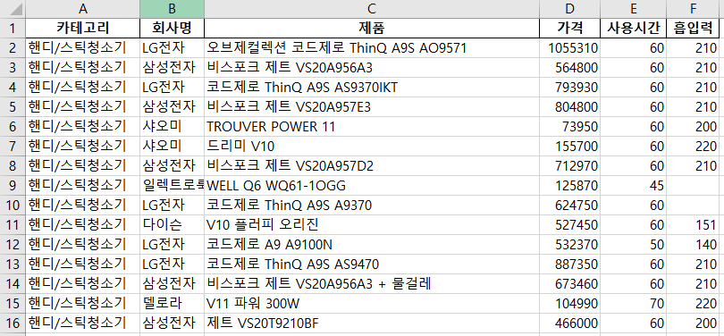
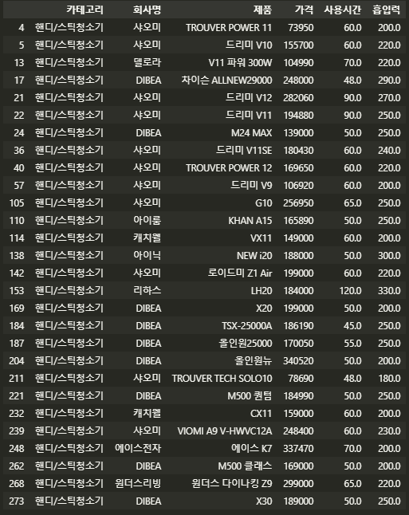
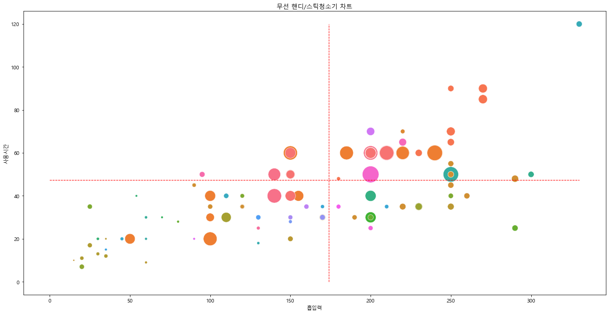
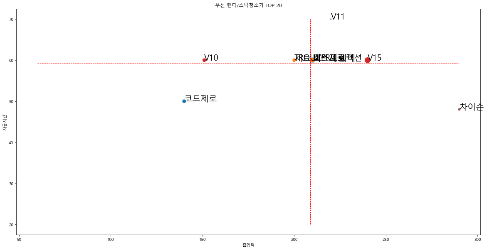

앞서 전처리한 결과**(danawa_data)**를 가지고 기준에 따라 제품을 살펴본다.


### 가성비 제품 찾기

가성비가 좋다는 건 보통 가격에 비해 성능(사용시간, 흡입력) 이 뛰어나다는 것을 의미한다. 전체 제품의 **가격, 사용시간, 흡입력의 평균**을 구하고 이를 기준으로 가성비가 좋은 제품을 검색해본다.

```python
value_mean = round(danawa_data['가격'].mean())
use_time_mean = round(danawa_data['사용시간'].mean())
suction_power_mean = round(danawa_data['흡입력'].mean())
>>>
363984 44 173
```

```python
gasungbi = danawa_data[(danawa_data['가격']<=value_mean) & 
                       (danawa_data['사용시간']>use_time_mean) & 
                       (danawa_data['흡입력']>suction_power_mean)]
```



위의 제품들이 가성비가 좋은 제품들이라고 할 수 있다.

```python
### Counter 함수를 이용해 각 원소의 개수 검색
from collections import Counter
cnt = Counter(gasungbi['회사명'])
print(cnt)
>>>
Counter({'샤오미': 11, 'DIBEA': 9, '캐치웰': 2, '델로라': 1, '아이룸': 1, '아이닉': 1, '리하스': 1, '에이스전자': 1, '원더스리빙': 1})
```


### 시각화

**seaborn**의 `scatterplot()` 함수를 사용하여 데이터 분포를 시각화한다.

```python
from matplotlib import font_manager, rc
import matplotlib.pyplot as plt
import seaborn as sns
import platform 

# 그래프에서 한글 표기를 위한 글꼴 변경(윈도우, macOS에 대해 처리)
font_path = ''
if platform.system() == 'Windows': 
    font_path = 'c:/Windows/Fonts/malgun.ttf'
    font_name = font_manager.FontProperties(fname = font_path).get_name()
    rc('font', family = font_name)
elif platform.system() == 'Darwin':
    font_path = '/Users/$USER/Library/Fonts/AppleGothic.ttf'
    rc('font', family = 'AppleGothic')
else: 
    print('Check your OS system')
    
%matplotlib inline
```

정확한 차트를 그리기 위해 결측값도 제거한다.

```python
chart_data = danawa_data.dropna(axis = 0)
```

이제 흡입력과 사용 시간의 평균값을 가져와 그릴 수 있도록 **흡입력과 사용 시간의 최댓값**을 계산한다. 그리고 이를 이용해 그래프를 그려본다.

```python
# 흡입력, 사용시간 최대, 최소
suction_max_value = chart_data['흡입력'].max()
suction_mean_value = chart_data['흡입력'].mean()
use_time_max_value = chart_data['사용시간'].max()
use_time_mean_value = chart_data['사용시간'].mean()
```

```python
plt.figure(figsize=(20, 10))
plt.title("무선 핸디/스틱청소기 차트")
sns.scatterplot(x = '흡입력', y = '사용시간', size = '가격', hue = chart_data['회사명'], 
             data = chart_data, sizes = (10, 1000), legend = False)
plt.plot([0, suction_max_value], 
          [use_time_mean_value, use_time_mean_value], 
          'r--', 
          lw = 1 )
plt.plot([suction_mean_value, suction_mean_value], 
          [0, use_time_max_value], 
          'r--', 
          lw = 1 )
plt.show()
```



- 가운데 빨간 선은 **흡입력과 사용시간의 평균값**을 의미한다. 흡입력과 사용시간이 평균 이상인 제품의 가격이 높은 경향이 있다.


#### 인기 제품 시각화

```python
## 상위 15위 인기 제품 선택
chart_data_selected = chart_data[:15]
```

```python
suction_max_value = chart_data_selected['흡입력'].max()
suction_mean_value = chart_data_selected['흡입력'].mean()
use_time_max_value = chart_data_selected['사용시간'].max()
use_time_mean_value = chart_data_selected['사용시간'].mean()
plt.figure(figsize=(20, 10))
plt.title("무선 핸디/스틱청소기 TOP 15")
sns.scatterplot(x = '흡입력', 
                  y = '사용시간', 
                  size = '가격', 
                  hue = chart_data_selected['회사명'], 
                  data = chart_data_selected, sizes = (10, 200),
                  legend = False)
plt.plot([60, suction_max_value], 
          [use_time_mean_value, use_time_mean_value], 
          'r--', 
          lw = 1 )
plt.plot([suction_mean_value, suction_mean_value], 
          [20, use_time_max_value], 
          'r--', 
          lw = 1 )
for index, row in chart_data_selected.iterrows():
    x = row['흡입력']
    y = row['사용시간']
    s = row['제품'].split(' ')[0]
    plt.text(x, y, s, size=20)
plt.show()
```



- 대부분의 상위제품이 상위제품의 평균값에서도 이상이란 것을 알 수 있다.